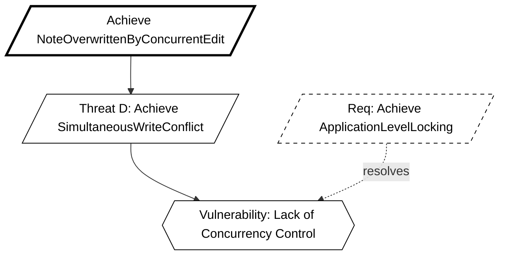
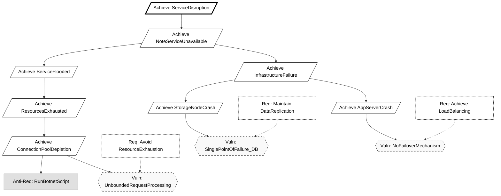

# KAOS Security Requirements Engineering Report
**Group:** 16 
**Methodology:** KAOS (Knowledge Acquisition in autOmated Specification) 
**Application:** Secure Notes App

## 1. Introduction
This document defines the security requirements for the Secure Notes Application using the Anti-Model construction method described by van Lamsweerde. We proceed by defining legitimate System Goals, deriving malicious Anti-Goals (Attacker Intents), refining these into Threat Trees, and finally selecting Countermeasures (Security Requirements).

## 1.1 Threat Agent Profiles (The "Who")
Based on the Anti-Model construction method we identify the following attacker classes:

1.  **The External Hacker:**
    * **Goal:** `Achieve [SensitiveDataStolen]` (Confidentiality breach).
    * **Capabilities:** Network sniffing, SQL injection tools (e.g., SQLMap), brute-force scripts.
    * **Motivation:** Financial gain or identity theft.

2.  **The Malicious Insider (The "Traitor"):**
    * **Goal:** `Achieve [WriteByReadOnlyUser]` (Integrity breach).
    * **Capabilities:** Authenticated access, knowledge of API endpoints, but limited permissions.
    * **Motivation:** Vandalism or privilege escalation.

---

## 2. Confidentiality Goals (User Isolation)

### 2.1 The System Goal
**Goal:** `Avoid [NoteContentKnownByUnauthorizedUser]` 
**Formal Pattern:** `Avoid [SensitiveInfoKnownByUnauthorizedAgent]` 
**Definition:** For any Note `n` and User `u`, if `u` is not the owner of `n` (and `n` is not shared with `u`), then `u` shall not know `n.content`.

### 2.2 The Anti-Model (Attacker Intent)
**Anti-Goal:** `Achieve [NoteContentKnownByUnauthorizedUser]` 
**Attacker:** Malicious User / External Hacker.

#### Threat Tree Refinement:
How can the attacker achieve this?
1.  **Threat A:** `Achieve [AccessNoteByGuessingID]`
    * **Vulnerability:** The system uses predictable, sequential IDs (e.g., `/notes/1`, `/notes/2`).
    * **Attacker Capability:** The attacker can iterate through integers to access resources they don't own.

2.  **Threat B:** `Achieve [AccessNoteBySQLInjection]`
    * **Vulnerability:** User input is concatenated directly into SQL queries.
    * **Attacker Capability:** Inject SQL fragments to bypass ownership checks (e.g., `' OR '1'='1`).

3.  **Threat C:** `Achieve [AccessNoteBySessionHijacking]`
    * **Vulnerability:** Session IDs are exposed or predictable.

4.  **Threat D (Infrastructure):** `Achieve [NoteContentSniffedOnNetwork]`
    * **Scenario:** An attacker on the same Wi-Fi network uses packet sniffing tools (e.g., Wireshark) to capture traffic between the user and the server.
    * **Vulnerability:** The application uses unencrypted HTTP channels for API communication.

5.  **Threat E (Client-Side):** `Achieve [NoteReadFromBrowserCache]`
    * **Scenario:** A user accesses the app from a shared computer (library/cafe). After they log out, an attacker hits the "Back" button to view cached pages.
    * **Vulnerability:** The server fails to send `Cache-Control: no-store` headers for sensitive JSON responses.

6.  **Threat F (Reconnaissance Milestone):** `Achieve [APIStructureKnown]`
    * **Scenario:** The attacker probes the API with malformed data to map out table names and column structures before launching an injection attack.
    * **Vulnerability:** The application returns verbose error messages (e.g., "Syntax error in table 'users'") or exposes public Swagger/OpenAPI documentation in production.

### 2.3 Derived Countermeasures
To resolve these threats, we introduce the following Security Requirements:

* **Countermeasure 1 (Protects against Threat A):** `Avoid [PredictableResourceIDs]`
    * **Implementation:** Use **UUIDs** (Universally Unique Identifiers) for all Note primary keys instead of auto-incrementing integers.
    * *Spring Boot:* Use `@GeneratedValue(strategy = GenerationType.UUID)` in the Note entity.

* **Countermeasure 2 (Protects against Threat B):** `Avoid [UnsanitizedDatabaseInput]`
    * **Implementation:** Use Parameterized Queries or an ORM that handles escaping.
    * *Spring Boot:* Use **Spring Data JPA** (Repository pattern) which automatically sanitizes inputs.

* **Countermeasure 3 (Protects against Threat C):** `Maintain [SecureSessionManagement]`
    * **Implementation:** Enforce strict session handling.
    * *Spring Boot:* Use **Spring Security** with HTTP-Only cookies and default session protection.

* **Countermeasure 4 (Protects against Threat D):** `Maintain [StrictTransportSecurity]`
    * **Implementation:** Enforce HTTPS for all traffic. Redirect HTTP to HTTPS.
    * *Spring Security:* Enable `requireChannel().anyRequest().requiresSecure()`.

* **Countermeasure 5 (Protects against Threat E):** `Avoid [SensitiveDataCaching]`
    * **Implementation:** Configure HTTP headers to prevent browser caching of API responses.
    * *Spring Security:* Add headers `Cache-Control: no-cache, no-store, max-age=0, must-revalidate`.

* **Countermeasure 6 (Protects against Threat F):** `Avoid [InformationLeakage]`
    * **Implementation:** Implement a global exception handler to return generic error messages (e.g., "An error occurred") instead of stack traces.

```mermaid
graph TD
    %% --- STYLING ---
    classDef root fill:#fff,stroke:#000,stroke-width:3px,color:#000;
    classDef goal fill:#fff,stroke:#000,stroke-width:1px,color:#000;
    classDef milestone fill:#fff,stroke:#000,stroke-width:2px,stroke-dasharray: 5 5,color:#000;
    classDef antiReq fill:#e0e0e0,stroke:#000,stroke-width:1px,color:#000;
    classDef vuln fill:#f9f9f9,stroke:#000,stroke-width:1px,stroke-dasharray: 5 5,color:#000;
    classDef cm fill:#fff,stroke:#000,stroke-width:1px,stroke-dasharray: 2 2,color:#000;

    %% ==========================================
    %% STRATEGIC ROOTS
    %% ==========================================
    AG_L1[/Achieve SensitiveDataStolen/]:::root
    AG_L2[/Achieve NoteContentKnownByUnauthorized/]:::goal
    AG_L1 --> AG_L2

    %% ==========================================
    %% THREAT F: RECONNAISSANCE (The Milestone)
    %% ==========================================
    AG_Milestone[/Milestone: Achieve APIStructureKnown/]:::milestone
    AG_L2 --> AG_Milestone

    Vuln_Verbose{{Vuln: VerboseErrorMessages}}:::vuln
    AG_Milestone --> Vuln_Verbose
    
    CM_Errors[Req: GenericErrorHandling]:::cm
    CM_Errors -.-> Vuln_Verbose

    %% ==========================================
    %% THREATS A & B: APPLICATION LOGIC ATTACKS
    %% ==========================================
    AG_AppLogic[/Achieve AccessViaAppLogic/]:::goal
    AG_Milestone --> AG_AppLogic

    %% --- THREAT A: ID GUESSING ---
    AG_L4_Direct[/Achieve AccessViaDirectReference/]:::goal
    AG_AppLogic --> AG_L4_Direct

    AG_L5_Probe[/Achieve ValidTargetIDIdentified/]:::goal
    AG_L4_Direct --> AG_L5_Probe

    AR_Iterate[Anti-Req: CheckIteratedIntegers]:::antiReq
    Vuln_SeqID{{Vuln: PredictableSequentialIDs}}:::vuln
    AG_L5_Probe --> AR_Iterate
    AG_L5_Probe --> Vuln_SeqID
    
    CM_UUID[Req: Avoid PredictableIDs]:::cm
    CM_UUID -.-> Vuln_SeqID

    %% --- THREAT B: SQL INJECTION ---
    AG_L4_Inject[/Achieve AccessViaQueryManipulation/]:::goal
    AG_AppLogic --> AG_L4_Inject

    AG_L5_Bypass[/Achieve AuthLogicBypassed/]:::goal
    AG_L4_Inject --> AG_L5_Bypass

    AR_SQL[Anti-Req: InjectSQLFragment]:::antiReq
    Vuln_Sanity{{Vuln: UnsanitizedInput}}:::vuln
    AG_L5_Bypass --> AR_SQL
    AG_L5_Bypass --> Vuln_Sanity

    CM_JPA[Req: Avoid UnsanitizedInput]:::cm
    CM_JPA -.-> Vuln_Sanity

    %% ==========================================
    %% THREAT C: SESSION HIJACKING
    %% ==========================================
    AG_Hijack[/Achieve AccessViaSessionTheft/]:::goal
    AG_L2 --> AG_Hijack

    AR_Steal[Anti-Req: StealSessionToken]:::antiReq
    Vuln_Sess{{Vuln: WeakSessionConfig}}:::vuln
    AG_Hijack --> AR_Steal
    AG_Hijack --> Vuln_Sess

    CM_SecureSess[Req: SecureSessionMgmt]:::cm
    CM_SecureSess -.-> Vuln_Sess

    %% ==========================================
    %% THREAT D: NETWORK SNIFFING (Infrastructure)
    %% ==========================================
    AG_Network[/Achieve NoteContentSniffedOnNetwork/]:::goal
    AG_L2 --> AG_Network

    AR_Sniff[Anti-Req: RunPacketSniffer]:::antiReq
    Vuln_HTTP{{Vuln: UnencryptedHTTP}}:::vuln
    AG_Network --> AR_Sniff
    AG_Network --> Vuln_HTTP

    %% This link was fixed below (Changed Vuln_HTTPS to Vuln_HTTP)
    CM_HTTPS[Req: EnforceHTTPS]:::cm
    CM_HTTPS -.-> Vuln_HTTP

    %% ==========================================
    %% THREAT E: CLIENT-SIDE CACHING
    %% ==========================================
    AG_Client[/Achieve NoteReadFromBrowserCache/]:::goal
    AG_L2 --> AG_Client

    AR_Back[Anti-Req: HitBackButton]:::antiReq
    Vuln_Cache{{Vuln: MissingCacheHeaders}}:::vuln
    AG_Client --> AR_Back
    AG_Client --> Vuln_Cache

    CM_NoCache[Req: DisableCaching]:::cm
    CM_NoCache -.-> Vuln_Cache  
```

## 3. Integrity Goals (Concurrency & Locking)

### 3.1 The System Goal
**Goal:** `Maintain [NoteContentChangeOnlyIfLockedAndAuthorized]` 
**Formal Pattern:** `Maintain [ObjectInfoChangeOnlyIfCorrectAndAuthorized]` 
**Definition:** A Note `n` can only be updated by User `u` if `u` has write permissions AND `n` is currently locked by `u`.

### 3.2 The Anti-Model
**Anti-Goal:** `Achieve [NoteOverwrittenByConcurrentEdit]` 
**Attacker:** A second legitimate user (or race condition exploit).

#### Threat Tree Refinement:
1.  **Threat D:** `Achieve [SimultaneousWriteConflict]`
    * **Scenario:** User A and User B open the same note. User A saves. User B saves 1 second later, overwriting User A's work.
    * **Vulnerability:** Lack of concurrency control or locking mechanism.

2.  **Threat E:** `Achieve [WriteByReadOnlyUser]`
    * **Scenario:** User A shares a note with User B granting only "Read" permissions. User B maliciously sends a `POST /update` request to modify the content.
    * **Vulnerability:** The application checks if the user has access to the note (Authentication) but fails to verify the specific *permission level* (Authorization) for the write operation.
    * **Attacker Capability:** The attacker can craft raw HTTP requests bypassing the UI restrictions.

### 3.3 Derived Countermeasures
* **Countermeasure 4 (Protects against Threat D):** `Achieve [ApplicationLevelLocking]`
    * **Implementation:** Implement a "Locked Mode" where a user must acquire a lock before editing.
    * *Logic:*
        1. User requests "Edit Mode" -> Server checks `isLocked`.
        2. If `false`, set `isLocked=true`, `lockedBy=User`, `lockedAt=Now`.
        3. If `true` (and different user), deny access.
        4. Unlock on save or timeout.

* **Countermeasure 5 (Protects against Threat F):** `Maintai [GranularPermissionChecks]`
    * **Implementation:** Enforce Role-Based Access Control (RBAC) at the API endpoint level.
    * *Logic:*
        1.  `POST /api/notes/{id}` received.
        2.  Retrieve permission record for `(User, Note)`.
        3.  If `permission != WRITE`, return `403 Forbidden`.

## 4. Availability Goals (Resilient Storage & Uptime)

### 4.1 The System Goal
**Goal:** `Achieve [NoteAccessWhenNeeded]` 
**Formal Pattern:** `Achieve [ObjectInfoUsableWhenNeededAndAuthorized]` 
**Definition:** Authorized users must be able to retrieve their notes even if a storage node fails or the network is under stress.

### 4.2 The Anti-Model
**Anti-Goal:** `Achieve [NoteServiceUnavailable]` 
**Attacker:** Vandal / Extortionist (Active); Physical Infrastructure (Passive). 
**Strategic Motive:** `Achieve [BusinessDisruption]` or `Achieve [RansomDemand]`.

#### Threat Tree Refinement:
1.  **Threat G (Storage):** `Achieve [StorageNodeFailure]`
    * **Scenario:** The primary database container crashes or the disk corrupts.
    * **Vulnerability:** System relies on a single database instance (SPOF).
2.  **Threat H (Compute):** `Achieve [AppServerFailure]`
    * **Scenario:** The REST API process on Server A crashes due to a memory leak or bug.
    * **Vulnerability:** Client requests are hardcoded to a single server IP; no automatic failover to Server B.
3.  **Threat I (Network):** `Achieve [ServiceFlooded]` (DoS)
    * **Scenario:** An attacker sends 10,000 requests/second to the API, exhausting connection pools.
    * **Vulnerability:** Lack of **Rate Limiting** or Traffic Throttling in the API gateway.
    * **Attacker Capability:** Use of botnets or scripts (e.g., Low Orbit Ion Cannon).

### 4.3 Derived Countermeasures
* **Countermeasure 7 (Protects against Threat G):** `Maintain [DataReplication]`
    * **Implementation:** Deploy **Primary-Replica SQL Architecture**.
    * *Logic:* Writes go to Primary. Reads can go to Replica. If Primary dies, Replica is promoted.

* **Countermeasure 8 (Protects against Threat H):** `Achieve [LoadBalancing]`
    * **Implementation:** Put a **Load Balancer** (e.g., Nginx or HAProxy) in front of the two application servers.
    * *Logic:* The frontend connects to `lb.domain.com`. The LB forwards traffic to `server1` or `server2` based on health checks.

* **Countermeasure 9 (Protects against Threat I):** `Avoid [ResourceExhaustion]`
    * **Implementation:** Implement **Rate Limiting** (e.g., 100 req/min per IP).
    * *Spring Boot:* Use `Bucket4j` or Spring Cloud Gateway RateLimiter.

