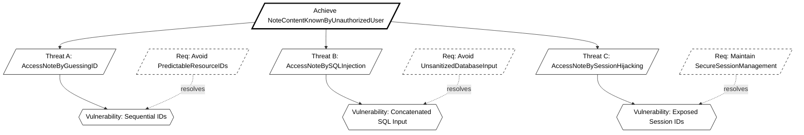
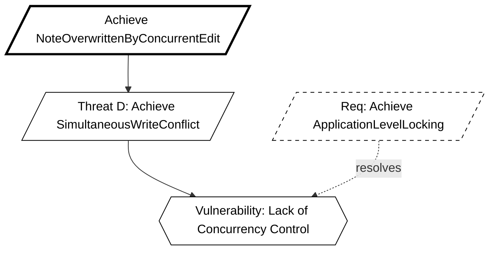
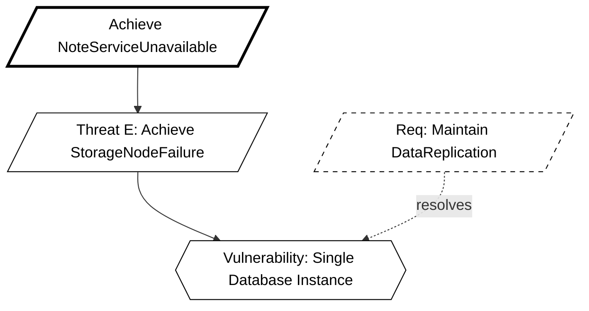

# KAOS Security Requirements Engineering Report
**Group:** 16 
**Methodology:** KAOS (Knowledge Acquisition in autOmated Specification) 
**Application:** Secure Notes App

## 1. Introduction
This document defines the security requirements for the Secure Notes Application using the Anti-Model construction method described by van Lamsweerde. We proceed by defining legitimate System Goals, deriving malicious Anti-Goals (Attacker Intents), refining these into Threat Trees, and finally selecting Countermeasures (Security Requirements).

---

## 2. Confidentiality Goals (User Isolation)

### 2.1 The System Goal
**Goal:** `Avoid [NoteContentKnownByUnauthorizedUser]` 
**Formal Pattern:** `Avoid [SensitiveInfoKnownByUnauthorizedAgent]` 
**Definition:** For any Note `n` and User `u`, if `u` is not the owner of `n` (and `n` is not shared with `u`), then `u` shall not know `n.content`.

### 2.2 The Anti-Model (Attacker Intent)
**Anti-Goal:** `Achieve [NoteContentKnownByUnauthorizedUser]` 
**Attacker:** Malicious User / External Hacker.

#### Threat Tree Refinement:
How can the attacker achieve this?
1.  **Threat A:** `Achieve [AccessNoteByGuessingID]`
    * **Vulnerability:** The system uses predictable, sequential IDs (e.g., `/notes/1`, `/notes/2`).
    * **Attacker Capability:** The attacker can iterate through integers to access resources they don't own.
2.  **Threat B:** `Achieve [AccessNoteBySQLInjection]`
    * **Vulnerability:** User input is concatenated directly into SQL queries.
    * **Attacker Capability:** Inject SQL fragments to bypass ownership checks (e.g., `' OR '1'='1`).
3.  **Threat C:** `Achieve [AccessNoteBySessionHijacking]`
    * **Vulnerability:** Session IDs are exposed or predictable.

### 2.3 Derived Countermeasures
To resolve these threats, we introduce the following Security Requirements:

* **Countermeasure 1 (Protects against Threat A):** `Avoid [PredictableResourceIDs]`
    * **Implementation:** Use **UUIDs** (Universally Unique Identifiers) for all Note primary keys instead of auto-incrementing integers.
    * *Spring Boot:* Use `@GeneratedValue(strategy = GenerationType.UUID)` in the Note entity.

* **Countermeasure 2 (Protects against Threat B):** `Avoid [UnsanitizedDatabaseInput]`
    * **Implementation:** Use Parameterized Queries or an ORM that handles escaping.
    * *Spring Boot:* Use **Spring Data JPA** (Repository pattern) which automatically sanitizes inputs.

* **Countermeasure 3 (Protects against Threat C):** `Maintain [SecureSessionManagement]`
    * **Implementation:** Enforce strict session handling.
    * *Spring Boot:* Use **Spring Security** with HTTP-Only cookies and default session protection.

## 3. Integrity Goals (Concurrency & Locking)

### 3.1 The System Goal
**Goal:** `Maintain [NoteContentChangeOnlyIfLockedAndAuthorized]` 
**Formal Pattern:** `Maintain [ObjectInfoChangeOnlyIfCorrectAndAuthorized]` 
**Definition:** A Note `n` can only be updated by User `u` if `u` has write permissions AND `n` is currently locked by `u`.

### 3.2 The Anti-Model
**Anti-Goal:** `Achieve [NoteOverwrittenByConcurrentEdit]` 
**Attacker:** A second legitimate user (or race condition exploit).

#### Threat Tree Refinement:
1.  **Threat D:** `Achieve [SimultaneousWriteConflict]`
    * **Scenario:** User A and User B open the same note. User A saves. User B saves 1 second later, overwriting User A's work.
    * **Vulnerability:** Lack of concurrency control or locking mechanism.

2.  **Threat E:** `Achieve [WriteByReadOnlyUser]`
    * **Scenario:** User A shares a note with User B granting only "Read" permissions. User B maliciously sends a `POST /update` request to modify the content.
    * **Vulnerability:** The application checks if the user has access to the note (Authentication) but fails to verify the specific *permission level* (Authorization) for the write operation.
    * **Attacker Capability:** The attacker can craft raw HTTP requests bypassing the UI restrictions.

### 3.3 Derived Countermeasures
* **Countermeasure 4 (Protects against Threat D):** `Achieve [ApplicationLevelLocking]`
    * **Implementation:** Implement a "Locked Mode" where a user must acquire a lock before editing.
    * *Logic:*
        1. User requests "Edit Mode" -> Server checks `isLocked`.
        2. If `false`, set `isLocked=true`, `lockedBy=User`, `lockedAt=Now`.
        3. If `true` (and different user), deny access.
        4. Unlock on save or timeout.

* **Countermeasure 5 (Protects against Threat F):** `Maintai [GranularPermissionChecks]`
    * **Implementation:** Enforce Role-Based Access Control (RBAC) at the API endpoint level.
    * *Logic:*
        1.  `POST /api/notes/{id}` received.
        2.  Retrieve permission record for `(User, Note)`.
        3.  If `permission != WRITE`, return `403 Forbidden`.

## 4. Availability Goals (Resilient Storage)

### 4.1 The System Goal
**Goal:** `Achieve [NoteAccessWhenNeeded]` 
**Formal Pattern:** `Achieve [ObjectInfoUsableWhenNeededAndAuthorized]` 
**Definition:** Authorized users must be able to retrieve their notes even if a primary storage node fails.

### 4.2 The Anti-Model
**Anti-Goal:** `Achieve [NoteServiceUnavailable]` 
**Attacker:** DoS Attacker or Physical Infrastructure Failure.

#### Threat Tree Refinement:
1.  **Threat F:** `Achieve [StorageNodeFailure]`
    * **Vulnerability:** The system relies on a single database instance (`db-master`). If this container stops, data is inaccessible.

### 4.3 Derived Countermeasures
* **Countermeasure 6 (Protects against Threat E):** `Maintain [DataReplication]`
    * **Implementation:** Deploy two distinct backend server instances connected to a replicated SQL database cluster.
    * *Architecture:*
        1.  **Primary Node (Server A):** Handles Writes and Reads.
        2.  **Replica Node (Server B):** Handles Reads (and failover Writes if promoted).
        3.  **Failover Logic:** The application configuration must allow switching the Data Source URL if the primary connection times out.

## 5. Summary of Security Requirements (To-Do List)

| ID | Requirement | KAOS Justification | Implementation Status |
|----|------------|--------------------|-----------------------|
| **SR-1** | Use UUIDs for Note IDs | Counteracts `AccessNoteByGuessingID` | Pending               |
| **SR-2** | Spring Data JPA | Counteracts `AccessNoteBySQLInjection` | Pending               |
| **SR-3** | Spring Security Config | Counteracts `NoteContentKnownByUnauthorizedUser` | Pending               |
| **SR-4** | Note Locking Mechanism | Counteracts `SimultaneousWriteConflict` | Pending               |
| **SR-5** | Granular Write Permission Check | Counteracts `WriteByReadOnlyUser` | Pending |
| **SR-6** | Database Replication | Counteracts `StorageNodeFailure` | Pending               |
