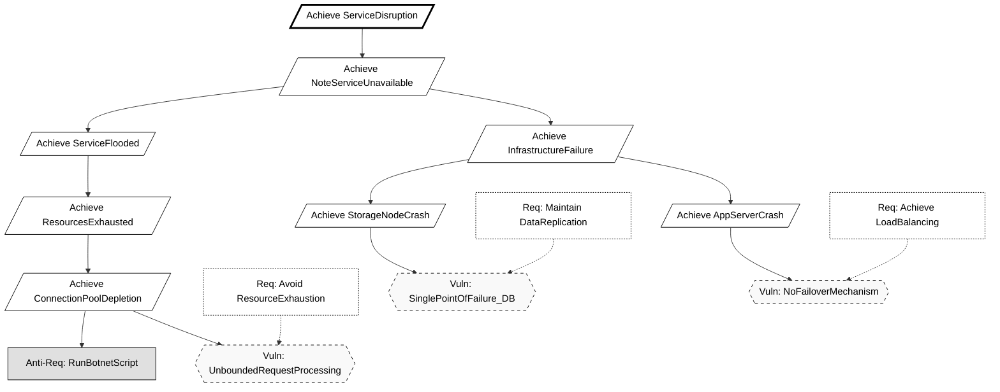
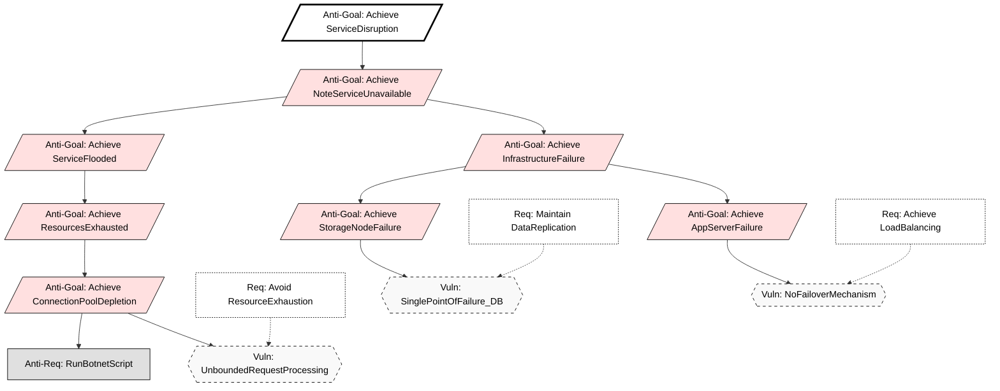

# KAOS Security Requirements Engineering Report
**Group:** 16<br>
**Methodology:** KAOS (Knowledge Acquisition in autOmated Specification)<br>
**Application:** Secure Notes App

## Diagram Legend
To keep the KAOS anti-model diagrams readable, we use different node types:

- **Goal / Requirement (Req):** Desired system security objective (e.g., `Avoid PredictableResourceIDs`, `Maintain SecureSessionManagement`).
- **Anti-Goal:** Attacker objective, expressed as something to **Achieve** (e.g., `Achieve NoteContentKnownByUnauthorizedUser`).
- **Anti-Requirement (Anti-Req):** Concrete attacker action needed to realize an Anti-Goal (e.g., `IterateOverSequentialIDs`, `RunBotnetScript`).
- **Vulnerability (Vuln):** Weakness in the system that enables an Anti-Requirement to succeed (e.g., `PredictableSequentialIDs`, `MissingGranularPermissionChecks`).
- **Countermeasure / Security Requirement (Req node in diagrams):** Design decision that mitigates or eliminates a Vulnerability (e.g., `Avoid ResourceExhaustion`, `Maintain DataReplication`).

These types correspond to the visual styling classes used in the Mermaid diagrams: `goal`, `antiGoal`, `antiReq`, `vuln`, and `cm`.

## 1. Introduction
This document defines the security requirements for the Secure Notes Application using the Anti-Model construction method described by van Lamsweerde. We proceed by defining legitimate System Goals, deriving malicious **Anti-Goals** (attacker intents), refining these into Threat Trees, and finally selecting Countermeasures (Security Requirements).

## 1.1 Threat Agent Profiles (The "Who")
Based on the Anti-Model construction method we identify the following attacker classes:

1.  **The External Hacker:**
    * **Anti-Goal:** `Achieve [SensitiveDataStolen]` (Confidentiality breach).
    * **Capabilities:** Network sniffing, SQL injection tools (e.g., SQLMap), brute-force scripts.
    * **Motivation:** Financial gain or identity theft.

2.  **The Malicious Insider (The "Traitor"):**
    * **Anti-Goal:** `Achieve [WriteByReadOnlyUser]` (Integrity breach).
    * **Capabilities:** Authenticated access, knowledge of API endpoints, but limited permissions.
    * **Motivation:** Vandalism or privilege escalation.

---

## 2. Confidentiality Goals (User Isolation)

### 2.1 The System Goal
**Goal:** `Avoid [NoteContentKnownByUnauthorizedUser]`<br>
**Formal Pattern:** `Avoid [SensitiveInfoKnownByUnauthorizedAgent]`<br>
**Definition:** For any Note `n` and User `u`, if `u` is not the owner of `n` (and `n` is not shared with `u`), then `u` shall not know `n.content`.

### 2.2 The Anti-Model (Attacker Intent)
**Top-Level Anti-Goal:** `Achieve [NoteContentKnownByUnauthorizedUser]`<br>
**Attacker:** Malicious User / External Hacker.

#### Threat Tree Refinement:
How can the attacker achieve this?
1.  **Threat A:** `Achieve [AccessNoteByGuessingID]`
    * **Anti-Goal:** `Achieve [AccessNoteByGuessingID]`.
    * **Vulnerability:** The system uses predictable, sequential IDs (e.g., `/notes/1`, `/notes/2`).
    * **Attacker Capability:** The attacker can iterate through integers to access resources they don't own.

2.  **Threat B:** `Achieve [AccessNoteBySQLInjection]`
    * **Anti-Goal:** `Achieve [AccessNoteBySQLInjection]`.
    * **Vulnerability:** User input is concatenated directly into SQL queries.
    * **Attacker Capability:** Inject SQL fragments to bypass ownership checks (e.g., `' OR '1'='1`).

3.  **Threat C:** `Achieve [AccessNoteBySessionHijacking]`
    * **Anti-Goal:** `Achieve [AccessNoteBySessionHijacking]`.
    * **Vulnerability:** Session IDs are exposed or predictable.

4.  **Threat D (Infrastructure):** `Achieve [NoteContentSniffedOnNetwork]`
    * **Anti-Goal:** `Achieve [NoteContentSniffedOnNetwork]`.
    * **Scenario:** An attacker on the same Wi-Fi network uses packet sniffing tools (e.g., Wireshark) to capture traffic between the user and the server.
    * **Vulnerability:** The application uses unencrypted HTTP channels for API communication.

5.  **Threat E (Client-Side):** `Achieve [NoteReadFromBrowserCache]`
    * **Anti-Goal:** `Achieve [NoteReadFromBrowserCache]`.
    * **Scenario:** A user accesses the app from a shared computer (library/cafe). After they log out, an attacker hits the "Back" button to view cached pages.
    * **Vulnerability:** The server fails to send `Cache-Control: no-store` headers for sensitive HTML/JSON responses.

6.  **Threat F (Reconnaissance Milestone):** `Achieve [APIStructureKnown]`
    * **Anti-Goal:** `Achieve [APIStructureKnown]`.
    * **Scenario:** The attacker probes the API with malformed data to map out table names and column structures before launching an injection attack.
    * **Vulnerability:** The application returns verbose error messages (e.g., "Syntax error in table 'users'") or exposes public Swagger/OpenAPI documentation in production.

### 2.3 Derived Countermeasures
To resolve these threats, we introduce the following Security Requirements (Goals):

* **Countermeasure 1 (Protects against Threat A):** `Avoid [PredictableResourceIDs]`
    * **Requirement Goal:** `Avoid [PredictableResourceIDs]`.
    * **Implementation:** Use **UUIDs** (Universally Unique Identifiers) for all Note primary keys instead of auto-incrementing integers.
    * *Spring Boot:* Use `@GeneratedValue(strategy = GenerationType.UUID)` in the Note entity.

* **Countermeasure 2 (Protects against Threat B):** `Avoid [UnsanitizedDatabaseInput]`
    * **Requirement Goal:** `Avoid [UnsanitizedDatabaseInput]`.
    * **Implementation:** Use Parameterized Queries or an ORM that handles escaping.
    * *Spring Boot:* Use **Spring Data JPA** (Repository pattern) which automatically sanitizes inputs.

* **Countermeasure 3 (Protects against Threat C):** `Maintain [SecureSessionManagement]`
    * **Requirement Goal:** `Maintain [SecureSessionManagement]`.
    * **Implementation:** Enforce strict session handling.
    * *Spring Boot:* Use **Spring Security** with HTTP-Only cookies and default session protection.

* **Countermeasure 4 (Protects against Threat D):** `Maintain [StrictTransportSecurity]`
    * **Requirement Goal:** `Maintain [StrictTransportSecurity]`.
    * **Implementation:** Enforce HTTPS for all traffic. Redirect HTTP to HTTPS.
    * *Spring Security:* Enable `requireChannel().anyRequest().requiresSecure()`.

* **Countermeasure 5 (Protects against Threat E):** `Avoid [SensitiveDataCaching]`
    * **Requirement Goal:** `Avoid [SensitiveDataCaching]`.
    * **Implementation:** Configure HTTP headers to prevent browser caching of API responses.
    * *Spring Security:* Add headers `Cache-Control: no-cache, no-store, max-age=0, must-revalidate`.

* **Countermeasure 6 (Protects against Threat F):** `Avoid [InformationLeakage]`
    * **Requirement Goal:** `Avoid [InformationLeakage]`.
    * **Implementation:** Implement a global exception handler to return generic error messages (e.g., "An error occurred") instead of stack traces.

```mermaid
graph TD
    %% --- STYLING ---
    classDef root fill:#fff,stroke:#000,stroke-width:3px,color:#000;
    classDef goal fill:#fff,stroke:#000,stroke-width:1px,color:#000;
    classDef milestone fill:#fff,stroke:#000,stroke-width:2px,stroke-dasharray: 5 5,color:#000;
    classDef antiGoal fill:#ffe0e0,stroke:#000,stroke-width:1px,color:#000;
    classDef antiReq fill:#e0e0e0,stroke:#000,stroke-width:1px,color:#000;
    classDef vuln fill:#f9f9f9,stroke:#000,stroke-width:1px,stroke-dasharray: 5 5,color:#000;
    classDef cm fill:#fff,stroke:#000,stroke-width:1px,stroke-dasharray: 2 2,color:#000;

    %% ==========================================
    %% STRATEGIC ROOTS
    %% ==========================================
    AG_L1[/Anti-Goal: Achieve SensitiveDataStolen/]:::root
    AG_L2[/Anti-Goal: Achieve NoteContentKnownByUnauthorizedUser/]:::antiGoal
    AG_L1 --> AG_L2

    %% ==========================================
    %% THREAT F: RECONNAISSANCE (The Milestone)
    %% ==========================================
    AG_Milestone[/Anti-Goal: Achieve APIStructureKnown/]:::milestone
    AG_L2 --> AG_Milestone

    Vuln_Verbose{{Vuln: VerboseErrorMessages}}:::vuln
    AG_Milestone --> Vuln_Verbose
    
    CM_Errors[Req: Avoid InformationLeakage]:::cm
    CM_Errors -.-> Vuln_Verbose

    %% ==========================================
    %% THREATS A & B: APPLICATION LOGIC ATTACKS
    %% ==========================================
    AG_AppLogic[/Anti-Goal: Achieve AccessViaAppLogic/]:::antiGoal
    AG_Milestone --> AG_AppLogic

    %% --- THREAT A: ID GUESSING ---
    AG_L4_Direct[/Anti-Goal: Achieve AccessNoteByGuessingID/]:::antiGoal
    AG_AppLogic --> AG_L4_Direct

    AG_L5_Probe[/Anti-Goal: Achieve ValidTargetIDIdentified/]:::antiGoal
    AG_L4_Direct --> AG_L5_Probe

    AR_Iterate[Anti-Req: IterateOverSequentialIDs]:::antiReq
    Vuln_SeqID{{Vuln: PredictableSequentialIDs}}:::vuln
    AG_L5_Probe --> AR_Iterate
    AG_L5_Probe --> Vuln_SeqID
    
    CM_UUID[Req: Avoid PredictableResourceIDs]:::cm
    CM_UUID -.-> Vuln_SeqID

    %% --- THREAT B: SQL INJECTION ---
    AG_L4_Inject[/Anti-Goal: Achieve AccessNoteBySQLInjection/]:::antiGoal
    AG_AppLogic --> AG_L4_Inject

    AG_L5_Bypass[/Anti-Goal: Achieve AuthLogicBypassed/]:::antiGoal
    AG_L4_Inject --> AG_L5_Bypass

    AR_SQL[Anti-Req: InjectSQLFragment]:::antiReq
    Vuln_Sanity{{Vuln: UnsanitizedDatabaseInput}}:::vuln
    AG_L5_Bypass --> AR_SQL
    AG_L5_Bypass --> Vuln_Sanity

    CM_JPA[Req: Avoid UnsanitizedDatabaseInput]:::cm
    CM_JPA -.-> Vuln_Sanity

    %% ==========================================
    %% THREAT C: SESSION HIJACKING
    %% ==========================================
    AG_Hijack[/Anti-Goal: Achieve AccessNoteBySessionHijacking/]:::antiGoal
    AG_L2 --> AG_Hijack

    AR_Steal[Anti-Req: StealSessionToken]:::antiReq
    Vuln_Sess{{Vuln: WeakSessionConfig}}:::vuln
    AG_Hijack --> AR_Steal
    AG_Hijack --> Vuln_Sess

    CM_SecureSess[Req: Maintain SecureSessionManagement]:::cm
    CM_SecureSess -.-> Vuln_Sess

    %% ==========================================
    %% THREAT D: NETWORK SNIFFING (Infrastructure)
    %% ==========================================
    AG_Network[/Anti-Goal: Achieve NoteContentSniffedOnNetwork/]:::antiGoal
    AG_L2 --> AG_Network

    AR_Sniff[Anti-Req: RunPacketSniffer]:::antiReq
    Vuln_HTTP{{Vuln: UnencryptedHTTP}}:::vuln
    AG_Network --> AR_Sniff
    AG_Network --> Vuln_HTTP

    CM_HTTPS[Req: Maintain StrictTransportSecurity]:::cm
    CM_HTTPS -.-> Vuln_HTTP

    %% ==========================================
    %% THREAT E: CLIENT-SIDE CACHING
    %% ==========================================
    AG_Client[/Anti-Goal: Achieve NoteReadFromBrowserCache/]:::antiGoal
    AG_L2 --> AG_Client

    AR_Back[Anti-Req: UseBrowserBackButton]:::antiReq
    Vuln_Cache{{Vuln: MissingCacheHeaders}}:::vuln
    AG_Client --> AR_Back
    AG_Client --> Vuln_Cache

    CM_NoCache[Req: Avoid SensitiveDataCaching]:::cm
    CM_NoCache -.-> Vuln_Cache  
```



## 3. Integrity Goals (Concurrency & Locking)

### 3.1 The System Goal
**Goal:** `Maintain [NoteContentChangeOnlyIfLockedAndAuthorized]`<br>
**Formal Pattern:** `Maintain [ObjectInfoChangeOnlyIfCorrectAndAuthorized]`<br>
**Definition:** A Note `n` can only be updated by User `u` if `u` has write permissions AND `n` is currently locked by `u`.

**Goal:** Maintain `[NoteContentChangeOnlyIfLockedAndAuthorized]`  
**Formal Pattern:** Maintain `[ObjectInfoChangeOnlyIfCorrectAndAuthorized]`

**Definition:**  
A Note `n` can only be updated by User `u` if:
- `u` has **WRITE** permission on `n`, and
- `n` is **currently locked by `u`** at the time of the update (the lock is valid and not expired), and
- the update is applied to the **current state of the note**, and
- all authorization, lock, and concurrency checks together with the update are executed **atomically**.


This goal enforces data integrity, preventing accidental or malicious overwrites and unauthorized modifications.


### 3.2 The Anti-Model
**Top-Level Anti-Goal:** `Achieve [NoteOverwrittenByConcurrentEdit]`<br>
**Attacker:** A second legitimate user (or race condition exploit).

**Anti-Goal:** Achieve `[NoteContentModifiedWithoutValidLockOrAuthorization]`  
**Attacker:** A second legitimate user, a read-only user abusing the API, or a race-condition exploit.

#### Threat Tree Refinement  
**How can the attacker achieve this?**


### Threat M: Achieve `[SimultaneousWriteConflict]`

**Scenario (general):**
- User A and User B open the same note.
- User A saves changes.
- User B saves changes shortly after, overwriting User A’s work.

#### Threat M – Sub-cases

**Threat M1: UpdateWithoutHoldingLock**  
- *Scenario:* User sends an update request without having previously acquired the lock.  
- *Vulnerability:* The server does not verify that the user currently holds the lock when processing an update.

**Threat M2: LockBypassViaDirectEndpoint**  
- *Scenario:* User directly calls `POST/PUT /api/notes/{id}` without going through “Edit Mode”.  
- *Vulnerability:* The update endpoint does not enforce prior lock acquisition or lock ownership validation.

**Threat M3: StaleLockNotReleased**  
- *Scenario:* User A acquires a lock and then closes the browser or loses network connection. The lock remains active indefinitely.  
- *Vulnerability:* No lock timeout (TTL) or automatic recovery mechanism exists.

**Threat M4: LostUpdateDueToMissingConcurrencyCheck**  
- *Scenario:* Two update requests based on different states of the same note are sent. The later request overwrites the earlier one without detection.  
- *Vulnerability:* The system does not verify that the update is based on the current state of the note.

**Threat M5: UnauthorizedUnlockOrLockStealing**  
- *Scenario:* User B attempts to unlock or re-lock a note currently locked by User A via a direct API call, then overwrites the content.  
- *Vulnerability:* The server does not enforce that only the lock owner (or an expired-lock policy) can unlock or change lock ownership.


### Threat N: Achieve `[WriteByReadOnlyUser]`

**Scenario (general):**
- User A shares a note with User B granting only **READ** permission.
- User B manually sends an HTTP request to modify the note.

#### Threat N – Sub-cases

#### Threat Tree Refinement:
1.  **Threat G:** `Achieve [SimultaneousWriteConflict]`
    * **Anti-Goal:** `Achieve [SimultaneousWriteConflict]`.
    * **Scenario:** User A and User B open the same note. User A saves. User B saves 1 second later, overwriting User A's work.
    * **Vulnerability:** Lack of concurrency control or locking mechanism.
**Threat N1: RawHTTPRequestByReadOnlyUser**  
- *Scenario:* User B crafts a `POST/PUT /api/notes/{id}` request manually.  
- *Vulnerability:* The backend verifies authentication but not **WRITE** authorization.

**Threat N2: UIOnlyAuthorization**  
- *Scenario:* The UI disables the edit button, but the server trusts the UI state.  
- *Vulnerability:* Authorization is enforced only at frontend level, not server-side.

**Threat N3: PermissionChangedButNotRechecked**  
- *Scenario:* User B previously had WRITE permission, later downgraded to READ. The update endpoint does not re-check permissions at write time.  
- *Vulnerability:* Authorization is not validated per request at the API/service layer.

**Attacker Capability:**  
The attacker can craft raw HTTP requests bypassing frontend restrictions.


### Threat P: Achieve `[WriteAfterLockExpiration]`

**Scenario (general):**
- User A acquires a lock on a note and enters edit mode.
- User becomes inactive for a long period.
- The lock expires, but User A sends an outdated update request.

#### Threat P – Sub-cases

**Threat P1: WriteWithExpiredLock**  
- *Scenario:* User sends an update after `lockedAt + TTL`.  
- *Vulnerability:* The server checks lock ownership but not lock validity.

**Threat P2: ReplayOfOldUpdateRequest**  
- *Scenario:* An old update request is resent after the lock has expired.  
- *Vulnerability:* No freshness or state validation is performed at write time.


### Threat R: Achieve `[InconsistentWriteAcrossReplicas]`

**Scenario (general):**
- The system runs on two replicated servers.
- Lock or note version information differs between replicas due to replication delay.
- A write request is accepted on a replica holding stale state.

#### Threat R – Sub-cases

**Threat R1: NonGlobalLockState**  
- *Scenario:* A note is locked on one server but appears unlocked on another.  
- *Vulnerability:* Lock state is not globally consistent.

**Threat R2: DivergentVersionAcceptance**  
- *Scenario:* Two replicas accept updates using the same version identifier.  
- *Vulnerability:* Version identifiers are not globally monotonic.


2.  **Threat H:** `Achieve [WriteByReadOnlyUser]`
    * **Anti-Goal:** `Achieve [WriteByReadOnlyUser]`.
    * **Scenario:** User A shares a note with User B granting only "Read" permissions. User B maliciously sends a `POST /notes/{id}` request to modify the content.
    * **Vulnerability:** The application checks if the user has access to the note (Authentication) but fails to verify the specific *permission level* (Authorization) for the write operation.
    * **Attacker Capability:** The attacker can craft raw HTTP requests bypassing the UI restrictions.

### 3.3 Derived Countermeasures
* **Countermeasure 7 (Protects against Threat G):** `Achieve [ApplicationLevelLocking]`
    * **Requirement Goal:** `Achieve [ApplicationLevelLocking]`.
    * **Implementation:** Implement a "Locked Mode" where a user must acquire a lock before editing.
    * *Logic:*
        1. User requests "Edit Mode" -> Server checks `isLocked`.
        2. If `false`, set `isLocked=true`, `lockedBy=User`, `lockedAt=Now`.
        3. If `true` (and different user), deny access.
        4. Unlock on **save**, explicit **cancel editing**, or **timeout** (inactivity lease; e.g., 3 minutes).

#### Countermeasure 7 (Protects against Threat M and Threat P)

**Achieve `[ApplicationLevelLocking]`**

**Implementation:**  
Implement a strict **Locked Mode**, enforced server-side.

**Logic:**

- **Lock acquisition (Edit Mode):**
  - User requests “Edit Mode”.
  - Server checks `isLocked`:
    - if `false`:
      - set `isLocked = true`
      - set `lockedBy = User`
      - set `lockedAt = Now`
    - if `true` and `lockedBy != User`:
      - deny lock acquisition.

- **Update validation (`POST/PUT /api/notes/{id}`):**
  - verify WRITE permission
  - verify `lockedBy == User`
  - verify `currentTime < lockedAt + TTL`
  - verify concurrency token (see CM9)
  - apply update and version increment atomically
  - if any check fails → reject without modifying state.

- **Unlock:**
  - allow unlock only if:
    - `lockedBy == User`, or
    - lock is expired (automatic cleanup).

**Effect:**  
Prevents simultaneous writes, updates without lock, updates using expired locks, unauthorized lock manipulation, and race conditions between validation and persistence.


#### Countermeasure 8 (Protects against Threat N)

**Maintain `[GranularPermissionChecks]`**

**Implementation:**  
Enforce **Role-Based Access Control (RBAC)** at API/service level.

**Logic:**
- `POST/PUT /api/notes/{id}` received.
- Retrieve permission record for `(User, Note)`.
- If `permission != WRITE` → return `403 Forbidden`.

**Effect:**  
Ensures that read-only users cannot modify notes, regardless of UI behavior.


#### Countermeasure 9 (Protects against Threat M4 and Threat P2)

**Maintain `[ConcurrencyTokenCheck]`**

**Implementation:**  
Associate each note with a **state identifier** (monotonically increasing version number or ETag).

**Logic:**
- Client retrieves the note with its state identifier.
- Client sends the identifier with the update request.
- Server verifies the identifier matches the current note state.
- If it does not match → reject the update (`409 Conflict`).

**Effect:**  
Prevents lost updates and replay of outdated update requests.


#### Countermeasure 10 (Protects against Threat R)

**Maintain `[SingleWriterForReplicatedSystem]`**

**Implementation:**  
Enforce a **single-writer policy**.

**Logic:**
- Only one server (leader) accepts `LOCK` and `WRITE` operations.
- Secondary replicas serve read-only requests.
- All lock and version updates are generated exclusively by the leader.
- Write requests received by non-leader replicas are rejected or redirected.

**Effect:**  
Prevents inconsistent writes, split-brain behavior, and divergence of lock or version state across replicas.


#### Countermeasure 11 (Supports Threat P)

**Achieve `[LockRenewal]`**

**Implementation:**  
Introduce explicit lock renewal.

**Logic:**
- Client periodically sends `LOCK_RENEW` requests.
- Only the lock owner may renew.
- Renewal extends lock validity (`lockedAt` or `lockExpiresAt`).
- If renewals stop, the lock expires automatically.

**Effect:**  
Prevents accidental lock expiration during long editing sessions while preserving recovery from abandoned locks.

```mermaid
graph TD
    %% --- STYLING ---
    classDef root fill:#fff,stroke:#000,stroke-width:3px,color:#000;
    classDef goal fill:#fff,stroke:#000,stroke-width:1px,color:#000;
    classDef antiReq fill:#e0e0e0,stroke:#000,stroke-width:1px,color:#000;
    classDef vuln fill:#f9f9f9,stroke:#000,stroke-width:1px,stroke-dasharray:5 5,color:#000;
    classDef cm fill:#fff,stroke:#000,stroke-width:1px,stroke-dasharray:2 2,color:#000;

* **Countermeasure 8 (Protects against Threat H):** `Maintai [GranularPermissionChecks]`
* **Countermeasure 8 (Protects against Threat H):** `Maintain [GranularPermissionChecks]`
    * **Requirement Goal:** `Maintain [GranularPermissionChecks]`.
    * **Implementation:** Enforce Role-Based Access Control (RBAC) at the API endpoint level.
    * *Logic:*
        1.  `POST /notes/{id}` received.
        2.  Retrieve permission record for `(User, Note)`.
        3.  If `permission != WRITE`, return `403 Forbidden`.

```mermaid
graph TD
%% --- STYLING ---
    classDef root fill:#fff,stroke:#000,stroke-width:3px,color:#000;
    classDef goal fill:#fff,stroke:#000,stroke-width:1px,color:#000;
    classDef antiGoal fill:#ffe0e0,stroke:#000,stroke-width:1px,color:#000;
    classDef antiReq fill:#e0e0e0,stroke:#000,stroke-width:1px,color:#000;
    classDef vuln fill:#f9f9f9,stroke:#000,stroke-width:1px,stroke-dasharray: 5 5,color:#000;
    classDef cm fill:#fff,stroke:#000,stroke-width:1px,stroke-dasharray: 2 2,color:#000;

%% ==========================================
%% STRATEGIC ROOTS
%% ==========================================
    AG_Root[/Anti-Goal: Achieve IntegrityViolation/]:::root

%% ==========================================
%% BRANCH 1: CONCURRENCY (Race Conditions)
%% ==========================================
    AG_Overwrite[/Anti-Goal: Achieve NoteOverwrittenByConcurrentEdit/]:::antiGoal
    AG_Root --> AG_Overwrite
    %% ==========================
    %% SYSTEM GOAL
    %% ==========================
    G0[/Maintain NoteContentChangeOnlyIfLockedAndAuthorized/]:::root

    %% ==========================
    %% ANTI-GOAL
    %% ==========================
    AG[/Achieve NoteContentModifiedWithoutValidLockOrAuthorization/]:::goal
    G0 --> AG

    Attacker[Anti-Req: LegitUser or ReadOnlyUser or RaceExploit]:::antiReq
    AG --> Attacker

    %% ======================================================
    %% THREAT M — Simultaneous Write Conflict (VERTICAL)
    %% ======================================================
    AG --> M[/Threat M: Achieve SimultaneousWriteConflict/]:::goal
    M --> M1[/M1 UpdateWithoutHoldingLock/]:::goal
    M1 --> VM1{{Vuln NoLockOwnershipCheck}}:::vuln
    VM1 --> M2[/M2 LockBypassViaDirectEndpoint/]:::goal
    M2 --> VM2{{Vuln LockNotEnforcedOnUpdate}}:::vuln
    VM2 --> M3[/M3 StaleLockNotReleased/]:::goal
    M3 --> VM3{{Vuln MissingLockTTL}}:::vuln
    VM3 --> M4[/M4 LostUpdateDueToMissingConcurrencyCheck/]:::goal
    M4 --> VM4{{Vuln MissingStateValidation}}:::vuln
    VM4 --> M5[/M5 UnauthorizedUnlockOrLockStealing/]:::goal
    M5 --> VM5{{Vuln LockOwnerNotEnforced}}:::vuln

    %% ======================================================
    %% THREAT N — Write By Read-Only User (VERTICAL)
    %% ======================================================
    AG --> N[/Threat N: Achieve WriteByReadOnlyUser/]:::goal
    N --> N1[/N1 RawHTTPRequestByReadOnlyUser/]:::goal
    N1 --> VN1{{Vuln MissingWriteAuthorization}}:::vuln
    VN1 --> N2[/N2 UIOnlyAuthorization/]:::goal
    N2 --> VN2{{Vuln FrontendOnlyChecks}}:::vuln
    VN2 --> N3[/N3 PermissionChangedButNotRechecked/]:::goal
    N3 --> VN3{{Vuln NoPerRequestAuthCheck}}:::vuln

    %% ======================================================
    %% THREAT P — Write After Lock Expiration (VERTICAL)
    %% ======================================================
    AG --> P[/Threat P: Achieve WriteAfterLockExpiration/]:::goal
    P --> P1[/P1 WriteWithExpiredLock/]:::goal
    P1 --> VP1{{Vuln LockValidityNotChecked}}:::vuln
    VP1 --> P2[/P2 ReplayOfOldUpdateRequest/]:::goal
    P2 --> VP2{{Vuln NoFreshnessValidation}}:::vuln

    %% ======================================================
    %% THREAT R — Inconsistent Write Across Replicas (VERTICAL)
    %% ======================================================
    AG --> R[/Threat R: Achieve InconsistentWriteAcrossReplicas/]:::goal
    R --> R1[/R1 NonGlobalLockState/]:::goal
    R1 --> VR1{{Vuln LockStateNotGloballyConsistent}}:::vuln
    VR1 --> R2[/R2 DivergentVersionAcceptance/]:::goal
    R2 --> VR2{{Vuln VersionsNotMonotonic}}:::vuln

    %% ==========================
    %% COUNTERMEASURES
    %% ==========================
    CM7[Req ApplicationLevelLocking]:::cm
    CM8[Req GranularPermissionChecks]:::cm
    CM9[Req ConcurrencyTokenCheck]:::cm
    CM10[Req SingleWriterForReplicatedSystem]:::cm
    CM11[Req LockRenewal]:::cm

    %% ==========================
    %% RESOLUTION LINKS
    %% ==========================
    CM7 -.-> VM1
    CM7 -.-> VM2
    CM7 -.-> VM3
    CM7 -.-> VM5
    CM7 -.-> VP1

    CM8 -.-> VN1
    CM8 -.-> VN2
    CM8 -.-> VN3

    CM9 -.-> VM4
    CM9 -.-> VP2

    CM10 -.-> VR1
    CM10 -.-> VR2

    CM11 -.-> VP1

```

## 4. Availability Goals (Resilient Storage & Uptime)
%% Refinement
    AG_Simul[/Anti-Goal: Achieve SimultaneousWriteConflict/]:::antiGoal
    AG_Overwrite --> AG_Simul

%% Specific Scenario: The Race Condition
    AG_Race[/Anti-Goal: Achieve SaveAfterOtherUser/]:::antiGoal
    AG_Simul --> AG_Race

%% Leaf Nodes (Vulnerability + Attacker Action)
    AR_Save[Anti-Req: TriggerSaveRaceCondition]:::antiReq
    Vuln_Lock{{Vuln: LackOfConcurrencyControl}}:::vuln

    AG_Race --> AR_Save
    AG_Race --> Vuln_Lock

%% Countermeasure
    CM_Lock[Req: Achieve ApplicationLevelLocking]:::cm
    CM_Lock -.-> Vuln_Lock

%% ==========================================
%% BRANCH 2: AUTHORIZATION BYPASS (Privilege Escalation)
%% ==========================================
    AG_Authz[/Anti-Goal: Achieve WriteByReadOnlyUser/]:::antiGoal
    AG_Root --> AG_Authz

%% Refinement: Bypassing the UI
    AG_BypassUI[/Anti-Goal: Achieve UIRestrictionsBypassed/]:::antiGoal
    AG_Authz --> AG_BypassUI

%% Leaf Nodes
    AR_Craft[Anti-Req: CraftRawUpdateRequest]:::antiReq
    Vuln_Perm{{Vuln: MissingGranularPermissionChecks}}:::vuln

    AG_BypassUI --> AR_Craft
    AG_BypassUI --> Vuln_Perm

%% Countermeasure
    CM_RBAC[Req: Maintain GranularPermissionChecks]:::cm
    CM_RBAC -.-> Vuln_Perm
````

## 4. Availability Goals (Resilient Storage & Uptime)

### 4.1 The System Goal
**Goal:** `Achieve [NoteAccessWhenNeeded]`<br>
**Formal Pattern:** `Achieve [ObjectInfoUsableWhenNeededAndAuthorized]`<br>
**Definition:** Authorized users must be able to retrieve their notes even if a storage node fails or the network is under stress.

### 4.2 The Anti-Model
**Top-Level Anti-Goal:** `Achieve [NoteServiceUnavailable]`<br>
**Attacker:** Vandal / Extortionist (Active); Physical Infrastructure (Passive).<br>
**Strategic Motive:** `Achieve [BusinessDisruption]` or `Achieve [RansomDemand]`.

#### Threat Tree Refinement:
1.  **Threat I (Storage):** `Achieve [StorageNodeFailure]`
    * **Anti-Goal:** `Achieve [StorageNodeFailure]`.
    * **Scenario:** The primary database container crashes or the disk corrupts.
    * **Vulnerability:** System relies on a single database instance (SPOF).
2.  **Threat J (Compute):** `Achieve [AppServerFailure]`
    * **Anti-Goal:** `Achieve [AppServerFailure]`.
    * **Scenario:** The REST API process on Server A crashes due to a memory leak or bug.
    * **Vulnerability:** Client requests are hardcoded to a single server IP; no automatic failover to Server B.
3.  **Threat K (Network):** `Achieve [ServiceFlooded]` (DoS)
    * **Anti-Goal:** `Achieve [ServiceFlooded]`.
    * **Scenario:** An attacker sends 10,000 requests/second to the API, exhausting connection pools.
    * **Vulnerability:** Lack of **Rate Limiting** or Traffic Throttling in the API gateway.
    * **Attacker Capability:** Use of botnets or scripts (e.g., Low Orbit Ion Cannon).
1.  **Threat G (Storage):** `Achieve [StorageNodeFailure]`
    * **Scenario:** The primary database container crashes or the disk corrupts.
    * **Vulnerability:** System relies on a single database instance (SPOF).
2.  **Threat H (Compute):** `Achieve [AppServerFailure]`
    * **Scenario:** The REST API process on Server A crashes due to a memory leak or bug.
    * **Vulnerability:** Client requests are hardcoded to a single server IP; no automatic failover to Server B.
3.  **Threat I (Network):** `Achieve [ServiceFlooded]` (DoS)
    * **Scenario:** An attacker sends 10,000 requests/second to the API, exhausting connection pools.
    * **Vulnerability:** Lack of **Rate Limiting** or Traffic Throttling in the API gateway.
    * **Attacker Capability:** Use of botnets or scripts (e.g., Low Orbit Ion Cannon).

### 4.3 Derived Countermeasures
* **Countermeasure 9 (Protects against Threat I):** `Maintain [DataReplication]`
    * **Requirement Goal:** `Maintain [DataReplication]`.
    * **Implementation:** Deploy **Primary-Replica SQL Architecture**.
    * *Logic:* Writes go to Primary. Reads can go to Replica. If Primary dies, Replica is promoted.

* **Countermeasure 10 (Protects against Threat J):** `Achieve [LoadBalancing]`
    * **Requirement Goal:** `Achieve [LoadBalancing]`.
    * **Implementation:** Put a **Load Balancer** (e.g., Nginx or HAProxy) in front of the two application servers.
    * *Logic:* The frontend connects to `lb.domain.com`. The LB forwards traffic to `server1` or `server2` based on health checks.
* **Countermeasure 12 (Protects against Threat G):** `Maintain [DataReplication]`
    * **Implementation:** Deploy **Primary-Replica SQL Architecture**.
    * *Logic:* Writes go to Primary. Reads can go to Replica. If Primary dies, Replica is promoted.

* **Countermeasure 13 (Protects against Threat H):** `Achieve [LoadBalancing]`
    * **Implementation:** Put a **Load Balancer** (e.g., Nginx or HAProxy) in front of the two application servers.
    * *Logic:* The frontend connects to `lb.domain.com`. The LB forwards traffic to `server1` or `server2` based on health checks.
* **Countermeasure 11 (Protects against Threat K):** `Avoid [ResourceExhaustion]`
    * **Requirement Goal:** `Avoid [ResourceExhaustion]`.
    * **Implementation:** Implement **Rate Limiting** (e.g., 100 req/min per IP).
    * *Spring Boot:* Use the custom `RateLimitFilter` already present in the code, or a library such as `Bucket4j`.

* **Countermeasure 14 (Protects against Threat I):** `Avoid [ResourceExhaustion]`
    * **Implementation:** Implement **Rate Limiting** (e.g., 100 req/min per IP).
    * *Spring Boot:* Use `Bucket4j` or Spring Cloud Gateway RateLimiter.


## 5. Summary of Security Requirements (To-Do List)


| ID | Security Requirement | KAOS Justification (Threats Addressed) | Implementation Status |
|----|---------------------|----------------------------------------|-----------------------|
| **SR-1** | Use UUIDs for Note IDs | Counteracts `AccessNoteByGuessingID` by preventing predictable direct object references | Pending |
| **SR-2** | Use Spring Data JPA / Parameterized Queries | Counteracts `AccessNoteBySQLInjection` by avoiding unsanitized SQL input | Pending |
| **SR-3** | Secure Session Management (Spring Security) | Counteracts `AccessNoteBySessionHijacking` via HTTP-Only cookies, secure session handling | Pending |
| **SR-4** | Enforce HTTPS (TLS) and redirect HTTP → HTTPS | Counteracts `NoteContentSniffedOnNetwork` by encrypting all client-server traffic | Pending |
| **SR-5** | Disable Browser Caching (`Cache-Control: no-store`) | Counteracts `NoteReadFromBrowserCache` on shared or public devices | Pending |
| **SR-6** | Generic Error Handling (no stack traces / verbose errors) | Counteracts `APIStructureKnown` by preventing reconnaissance via error messages | Pending |
| **SR-7** | Application-Level Note Locking with TTL (Locked Mode) | Counteracts `SimultaneousWriteConflict`, `WriteAfterLockExpiration`, `UnauthorizedUnlockOrLockStealing` | Pending |
| **SR-8** | Granular WRITE Permission Checks (RBAC, server-side per request) | Counteracts `WriteByReadOnlyUser` regardless of UI restrictions | Pending |
| **SR-9** | Concurrency Token Check (Version / ETag, reject stale updates with 409) | Counteracts `LostUpdateDueToMissingConcurrencyCheck`, `ReplayOfOldUpdateRequest` | Pending |
| **SR-10** | Single-Writer Policy for Replicated System (Leader-based writes) | Counteracts `InconsistentWriteAcrossReplicas` and split-brain writes | Pending |
| **SR-11** | Lock Renewal Endpoint (`LOCK_RENEW`) | Supports `WriteAfterLockExpiration` by preventing accidental lock expiry during long edits | Pending |
| **SR-12** | Data Replication (Primary–Replica SQL Storage) | Counteracts `StorageNodeFailure` and single-point-of-failure risks | Pending |
| **SR-13** | Load Balancing / Failover for Application Servers | Counteracts `AppServerFailure` by enabling automatic failover | Pending |
| **SR-14** | Rate Limiting / Traffic Throttling | Counteracts `ServiceFlooded` (DoS) and resource exhaustion attacks | Pending |

