# KAOS Security Requirements Engineering Report
**Group:** 16<br>
**Methodology:** KAOS (Knowledge Acquisition in autOmated Specification)<br>
**Application:** Secure Notes App

## Diagram Legend
To keep the KAOS anti-model diagrams readable, we use different node types:

- **Goal / Requirement (Req):** Desired system security objective (e.g., `Avoid PredictableResourceIDs`, `Maintain SecureSessionManagement`).
- **Anti-Goal:** Attacker objective, expressed as something to **Achieve** (e.g., `Achieve NoteContentKnownByUnauthorizedUser`).
- **Anti-Requirement (Anti-Req):** Concrete attacker action needed to realize an Anti-Goal (e.g., `IterateOverSequentialIDs`, `RunBotnetScript`).
- **Vulnerability (Vuln):** Weakness in the system that enables an Anti-Requirement to succeed (e.g., `PredictableSequentialIDs`, `MissingGranularPermissionChecks`).
- **Countermeasure / Security Requirement (Req node in diagrams):** Design decision that mitigates or eliminates a Vulnerability (e.g., `Avoid ResourceExhaustion`, `Maintain DataReplication`).

These types correspond to the visual styling classes used in the Mermaid diagrams: `goal`, `antiGoal`, `antiReq`, `vuln`, and `cm`.

## 1. Introduction
This document defines the security requirements for the Secure Notes Application using the Anti-Model construction method described by van Lamsweerde. We proceed by defining legitimate System Goals, deriving malicious **Anti-Goals** (attacker intents), refining these into Threat Trees, and finally selecting Countermeasures (Security Requirements).

## 1.1 Threat Agent Profiles (The "Who")
Based on the Anti-Model construction method we identify the following attacker classes:

1.  **The External Hacker:**
    * **Anti-Goal:** `Achieve [SensitiveDataStolen]` (Confidentiality breach).
    * **Capabilities:** Network sniffing, SQL injection tools (e.g., SQLMap), brute-force scripts.
    * **Motivation:** Financial gain or identity theft.

2.  **The Malicious Insider (The "Traitor"):**
    * **Anti-Goal:** `Achieve [WriteByReadOnlyUser]` (Integrity breach).
    * **Capabilities:** Authenticated access, knowledge of API endpoints, but limited permissions.
    * **Motivation:** Vandalism or privilege escalation.

---

## 2. Confidentiality Goals (User Isolation)

### 2.1 The System Goal
**Goal:** `Avoid [NoteContentKnownByUnauthorizedUser]`<br>
**Formal Pattern:** `Avoid [SensitiveInfoKnownByUnauthorizedAgent]`<br>
**Definition:** For any Note `n` and User `u`, if `u` is not the owner of `n` (and `n` is not shared with `u`), then `u` shall not know `n.content`.

### 2.2 The Anti-Model (Attacker Intent)
**Top-Level Anti-Goal:** `Achieve [NoteContentKnownByUnauthorizedUser]`<br>
**Attacker:** Malicious User / External Hacker.

#### Threat Tree Refinement:
How can the attacker achieve this?
1.  **Threat A:** `Achieve [AccessNoteByGuessingID]`
    * **Anti-Goal:** `Achieve [AccessNoteByGuessingID]`.
    * **Vulnerability:** The system uses predictable, sequential IDs (e.g., `/notes/1`, `/notes/2`).
    * **Attacker Capability:** The attacker can iterate through integers to access resources they don't own.

2.  **Threat B:** `Achieve [AccessNoteBySQLInjection]`
    * **Anti-Goal:** `Achieve [AccessNoteBySQLInjection]`.
    * **Vulnerability:** User input is concatenated directly into SQL queries.
    * **Attacker Capability:** Inject SQL fragments to bypass ownership checks (e.g., `' OR '1'='1`).

3.  **Threat C:** `Achieve [AccessNoteBySessionHijacking]`
    * **Anti-Goal:** `Achieve [AccessNoteBySessionHijacking]`.
    * **Vulnerability:** Session IDs are exposed or predictable.

4.  **Threat D (Infrastructure):** `Achieve [NoteContentSniffedOnNetwork]`
    * **Anti-Goal:** `Achieve [NoteContentSniffedOnNetwork]`.
    * **Scenario:** An attacker on the same Wi-Fi network uses packet sniffing tools (e.g., Wireshark) to capture traffic between the user and the server.
    * **Vulnerability:** The application uses unencrypted HTTP channels for API communication.

5.  **Threat E (Client-Side):** `Achieve [NoteReadFromBrowserCache]`
    * **Anti-Goal:** `Achieve [NoteReadFromBrowserCache]`.
    * **Scenario:** A user accesses the app from a shared computer (library/cafe). After they log out, an attacker hits the "Back" button to view cached pages.
    * **Vulnerability:** The server fails to send `Cache-Control: no-store` headers for sensitive HTML/JSON responses.

6.  **Threat F (Reconnaissance Milestone):** `Achieve [APIStructureKnown]`
    * **Anti-Goal:** `Achieve [APIStructureKnown]`.
    * **Scenario:** The attacker probes the API with malformed data to map out table names and column structures before launching an injection attack.
    * **Vulnerability:** The application returns verbose error messages (e.g., "Syntax error in table 'users'") or exposes public Swagger/OpenAPI documentation in production.

### 2.3 Derived Countermeasures
To resolve these threats, we introduce the following Security Requirements (Goals):

* **Countermeasure 1 (Protects against Threat A):** `Avoid [PredictableResourceIDs]`
    * **Requirement Goal:** `Avoid [PredictableResourceIDs]`.
    * **Implementation:** Use **UUIDs** (Universally Unique Identifiers) for all Note primary keys instead of auto-incrementing integers.
    * *Spring Boot:* Use `@GeneratedValue(strategy = GenerationType.UUID)` in the Note entity.

* **Countermeasure 2 (Protects against Threat B):** `Avoid [UnsanitizedDatabaseInput]`
    * **Requirement Goal:** `Avoid [UnsanitizedDatabaseInput]`.
    * **Implementation:** Use Parameterized Queries or an ORM that handles escaping.
    * *Spring Boot:* Use **Spring Data JPA** (Repository pattern) which automatically sanitizes inputs.

* **Countermeasure 3 (Protects against Threat C):** `Maintain [SecureSessionManagement]`
    * **Requirement Goal:** `Maintain [SecureSessionManagement]`.
    * **Implementation:** Enforce strict session handling.
    * *Spring Boot:* Use **Spring Security** with HTTP-Only cookies and default session protection.

* **Countermeasure 4 (Protects against Threat D):** `Maintain [StrictTransportSecurity]`
    * **Requirement Goal:** `Maintain [StrictTransportSecurity]`.
    * **Implementation:** Enforce HTTPS for all traffic. Redirect HTTP to HTTPS.
    * *Spring Security:* Enable `requireChannel().anyRequest().requiresSecure()`.

* **Countermeasure 5 (Protects against Threat E):** `Avoid [SensitiveDataCaching]`
    * **Requirement Goal:** `Avoid [SensitiveDataCaching]`.
    * **Implementation:** Configure HTTP headers to prevent browser caching of API responses.
    * *Spring Security:* Add headers `Cache-Control: no-cache, no-store, max-age=0, must-revalidate`.

* **Countermeasure 6 (Protects against Threat F):** `Avoid [InformationLeakage]`
    * **Requirement Goal:** `Avoid [InformationLeakage]`.
    * **Implementation:** Implement a global exception handler to return generic error messages (e.g., "An error occurred") instead of stack traces.

```mermaid
graph TD
    %% --- STYLING ---
    classDef root fill:#fff,stroke:#000,stroke-width:3px,color:#000;
    classDef goal fill:#fff,stroke:#000,stroke-width:1px,color:#000;
    classDef milestone fill:#fff,stroke:#000,stroke-width:2px,stroke-dasharray: 5 5,color:#000;
    classDef antiGoal fill:#ffe0e0,stroke:#000,stroke-width:1px,color:#000;
    classDef antiReq fill:#e0e0e0,stroke:#000,stroke-width:1px,color:#000;
    classDef vuln fill:#f9f9f9,stroke:#000,stroke-width:1px,stroke-dasharray: 5 5,color:#000;
    classDef cm fill:#fff,stroke:#000,stroke-width:1px,stroke-dasharray: 2 2,color:#000;

    %% ==========================================
    %% STRATEGIC ROOTS
    %% ==========================================
    AG_L1[/Anti-Goal: Achieve SensitiveDataStolen/]:::root
    AG_L2[/Anti-Goal: Achieve NoteContentKnownByUnauthorizedUser/]:::antiGoal
    AG_L1 --> AG_L2

    %% ==========================================
    %% THREAT F: RECONNAISSANCE (The Milestone)
    %% ==========================================
    AG_Milestone[/Anti-Goal: Achieve APIStructureKnown/]:::milestone
    AG_L2 --> AG_Milestone

    Vuln_Verbose{{Vuln: VerboseErrorMessages}}:::vuln
    AG_Milestone --> Vuln_Verbose
    
    CM_Errors[Req: Avoid InformationLeakage]:::cm
    CM_Errors -.-> Vuln_Verbose

    %% ==========================================
    %% THREATS A & B: APPLICATION LOGIC ATTACKS
    %% ==========================================
    AG_AppLogic[/Anti-Goal: Achieve AccessViaAppLogic/]:::antiGoal
    AG_Milestone --> AG_AppLogic

    %% --- THREAT A: ID GUESSING ---
    AG_L4_Direct[/Anti-Goal: Achieve AccessNoteByGuessingID/]:::antiGoal
    AG_AppLogic --> AG_L4_Direct

    AG_L5_Probe[/Anti-Goal: Achieve ValidTargetIDIdentified/]:::antiGoal
    AG_L4_Direct --> AG_L5_Probe

    AR_Iterate[Anti-Req: IterateOverSequentialIDs]:::antiReq
    Vuln_SeqID{{Vuln: PredictableSequentialIDs}}:::vuln
    AG_L5_Probe --> AR_Iterate
    AG_L5_Probe --> Vuln_SeqID
    
    CM_UUID[Req: Avoid PredictableResourceIDs]:::cm
    CM_UUID -.-> Vuln_SeqID

    %% --- THREAT B: SQL INJECTION ---
    AG_L4_Inject[/Anti-Goal: Achieve AccessNoteBySQLInjection/]:::antiGoal
    AG_AppLogic --> AG_L4_Inject

    AG_L5_Bypass[/Anti-Goal: Achieve AuthLogicBypassed/]:::antiGoal
    AG_L4_Inject --> AG_L5_Bypass

    AR_SQL[Anti-Req: InjectSQLFragment]:::antiReq
    Vuln_Sanity{{Vuln: UnsanitizedDatabaseInput}}:::vuln
    AG_L5_Bypass --> AR_SQL
    AG_L5_Bypass --> Vuln_Sanity

    CM_JPA[Req: Avoid UnsanitizedDatabaseInput]:::cm
    CM_JPA -.-> Vuln_Sanity

    %% ==========================================
    %% THREAT C: SESSION HIJACKING
    %% ==========================================
    AG_Hijack[/Anti-Goal: Achieve AccessNoteBySessionHijacking/]:::antiGoal
    AG_L2 --> AG_Hijack

    AR_Steal[Anti-Req: StealSessionToken]:::antiReq
    Vuln_Sess{{Vuln: WeakSessionConfig}}:::vuln
    AG_Hijack --> AR_Steal
    AG_Hijack --> Vuln_Sess

    CM_SecureSess[Req: Maintain SecureSessionManagement]:::cm
    CM_SecureSess -.-> Vuln_Sess

    %% ==========================================
    %% THREAT D: NETWORK SNIFFING (Infrastructure)
    %% ==========================================
    AG_Network[/Anti-Goal: Achieve NoteContentSniffedOnNetwork/]:::antiGoal
    AG_L2 --> AG_Network

    AR_Sniff[Anti-Req: RunPacketSniffer]:::antiReq
    Vuln_HTTP{{Vuln: UnencryptedHTTP}}:::vuln
    AG_Network --> AR_Sniff
    AG_Network --> Vuln_HTTP

    CM_HTTPS[Req: Maintain StrictTransportSecurity]:::cm
    CM_HTTPS -.-> Vuln_HTTP

    %% ==========================================
    %% THREAT E: CLIENT-SIDE CACHING
    %% ==========================================
    AG_Client[/Anti-Goal: Achieve NoteReadFromBrowserCache/]:::antiGoal
    AG_L2 --> AG_Client

    AR_Back[Anti-Req: UseBrowserBackButton]:::antiReq
    Vuln_Cache{{Vuln: MissingCacheHeaders}}:::vuln
    AG_Client --> AR_Back
    AG_Client --> Vuln_Cache

    CM_NoCache[Req: Avoid SensitiveDataCaching]:::cm
    CM_NoCache -.-> Vuln_Cache  
```



## 3. Integrity Goals (Concurrency & Locking)

### 3.1 The System Goal
**Goal:** `Maintain [NoteContentChangeOnlyIfLockedAndAuthorized]`<br>
**Formal Pattern:** `Maintain [ObjectInfoChangeOnlyIfCorrectAndAuthorized]`<br>
**Definition:** A Note `n` can only be updated by User `u` if `u` has write permissions AND `n` is currently locked by `u`.

### 3.2 The Anti-Model
**Top-Level Anti-Goal:** `Achieve [NoteOverwrittenByConcurrentEdit]`<br>
**Attacker:** A second legitimate user (or race condition exploit).

#### Threat Tree Refinement:
1.  **Threat G:** `Achieve [SimultaneousWriteConflict]`
    * **Anti-Goal:** `Achieve [SimultaneousWriteConflict]`.
    * **Scenario:** User A and User B open the same note. User A saves. User B saves 1 second later, overwriting User A's work.
    * **Vulnerability:** Lack of concurrency control or locking mechanism.

2.  **Threat H:** `Achieve [WriteByReadOnlyUser]`
    * **Anti-Goal:** `Achieve [WriteByReadOnlyUser]`.
    * **Scenario:** User A shares a note with User B granting only "Read" permissions. User B maliciously sends a `POST /notes/{id}` request to modify the content.
    * **Vulnerability:** The application checks if the user has access to the note (Authentication) but fails to verify the specific *permission level* (Authorization) for the write operation.
    * **Attacker Capability:** The attacker can craft raw HTTP requests bypassing the UI restrictions.

### 3.3 Derived Countermeasures
* **Countermeasure 7 (Protects against Threat G):** `Achieve [ApplicationLevelLocking]`
    * **Requirement Goal:** `Achieve [ApplicationLevelLocking]`.
    * **Implementation:** Implement a "Locked Mode" where a user must acquire a lock before editing.
    * *Logic:*
        1. User requests "Edit Mode" -> Server checks `isLocked`.
        2. If `false`, set `isLocked=true`, `lockedBy=User`, `lockedAt=Now`.
        3. If `true` (and different user), deny access.
        4. Unlock on **save**, explicit **cancel editing**, or **timeout** (inactivity lease; e.g., 3 minutes).

* **Countermeasure 8 (Protects against Threat H):** `Maintain [GranularPermissionChecks]`
    * **Requirement Goal:** `Maintain [GranularPermissionChecks]`.
    * **Implementation:** Enforce Role-Based Access Control (RBAC) at the API endpoint level.
    * *Logic:*
        1.  `POST /notes/{id}` received.
        2.  Retrieve permission record for `(User, Note)`.
        3.  If `permission != WRITE`, return `403 Forbidden`.

```mermaid
graph TD
%% --- STYLING ---
    classDef root fill:#fff,stroke:#000,stroke-width:3px,color:#000;
    classDef goal fill:#fff,stroke:#000,stroke-width:1px,color:#000;
    classDef antiGoal fill:#ffe0e0,stroke:#000,stroke-width:1px,color:#000;
    classDef antiReq fill:#e0e0e0,stroke:#000,stroke-width:1px,color:#000;
    classDef vuln fill:#f9f9f9,stroke:#000,stroke-width:1px,stroke-dasharray: 5 5,color:#000;
    classDef cm fill:#fff,stroke:#000,stroke-width:1px,stroke-dasharray: 2 2,color:#000;

%% ==========================================
%% STRATEGIC ROOTS
%% ==========================================
    AG_Root[/Anti-Goal: Achieve IntegrityViolation/]:::root

%% ==========================================
%% BRANCH 1: CONCURRENCY (Race Conditions)
%% ==========================================
    AG_Overwrite[/Anti-Goal: Achieve NoteOverwrittenByConcurrentEdit/]:::antiGoal
    AG_Root --> AG_Overwrite

%% Refinement
    AG_Simul[/Anti-Goal: Achieve SimultaneousWriteConflict/]:::antiGoal
    AG_Overwrite --> AG_Simul

%% Specific Scenario: The Race Condition
    AG_Race[/Anti-Goal: Achieve SaveAfterOtherUser/]:::antiGoal
    AG_Simul --> AG_Race

%% Leaf Nodes (Vulnerability + Attacker Action)
    AR_Save[Anti-Req: TriggerSaveRaceCondition]:::antiReq
    Vuln_Lock{{Vuln: LackOfConcurrencyControl}}:::vuln

    AG_Race --> AR_Save
    AG_Race --> Vuln_Lock

%% Countermeasure
    CM_Lock[Req: Achieve ApplicationLevelLocking]:::cm
    CM_Lock -.-> Vuln_Lock

%% ==========================================
%% BRANCH 2: AUTHORIZATION BYPASS (Privilege Escalation)
%% ==========================================
    AG_Authz[/Anti-Goal: Achieve WriteByReadOnlyUser/]:::antiGoal
    AG_Root --> AG_Authz

%% Refinement: Bypassing the UI
    AG_BypassUI[/Anti-Goal: Achieve UIRestrictionsBypassed/]:::antiGoal
    AG_Authz --> AG_BypassUI

%% Leaf Nodes
    AR_Craft[Anti-Req: CraftRawUpdateRequest]:::antiReq
    Vuln_Perm{{Vuln: MissingGranularPermissionChecks}}:::vuln

    AG_BypassUI --> AR_Craft
    AG_BypassUI --> Vuln_Perm

%% Countermeasure
    CM_RBAC[Req: Maintain GranularPermissionChecks]:::cm
    CM_RBAC -.-> Vuln_Perm
````

## 4. Availability Goals (Resilient Storage & Uptime)

### 4.1 The System Goal
**Goal:** `Achieve [NoteAccessWhenNeeded]`<br>
**Formal Pattern:** `Achieve [ObjectInfoUsableWhenNeededAndAuthorized]`<br>
**Definition:** Authorized users must be able to retrieve their notes even if a storage node fails or the network is under stress.

### 4.2 The Anti-Model
**Top-Level Anti-Goal:** `Achieve [NoteServiceUnavailable]`<br>
**Attacker:** Vandal / Extortionist (Active); Physical Infrastructure (Passive).<br>
**Strategic Motive:** `Achieve [BusinessDisruption]` or `Achieve [RansomDemand]`.

#### Threat Tree Refinement:
1.  **Threat I (Storage):** `Achieve [StorageNodeFailure]`
    * **Anti-Goal:** `Achieve [StorageNodeFailure]`.
    * **Scenario:** The primary database container crashes or the disk corrupts.
    * **Vulnerability:** System relies on a single database instance (SPOF).
2.  **Threat J (Compute):** `Achieve [AppServerFailure]`
    * **Anti-Goal:** `Achieve [AppServerFailure]`.
    * **Scenario:** The REST API process on Server A crashes due to a memory leak or bug.
    * **Vulnerability:** Client requests are hardcoded to a single server IP; no automatic failover to Server B.
3.  **Threat K (Network):** `Achieve [ServiceFlooded]` (DoS)
    * **Anti-Goal:** `Achieve [ServiceFlooded]`.
    * **Scenario:** An attacker sends 10,000 requests/second to the API, exhausting connection pools.
    * **Vulnerability:** Lack of **Rate Limiting** or Traffic Throttling in the API gateway.
    * **Attacker Capability:** Use of botnets or scripts (e.g., Low Orbit Ion Cannon).

### 4.3 Derived Countermeasures
* **Countermeasure 9 (Protects against Threat I):** `Maintain [DataReplication]`
    * **Requirement Goal:** `Maintain [DataReplication]`.
    * **Implementation:** Deploy **Primary-Replica SQL Architecture**.
    * *Logic:* Writes go to Primary. Reads can go to Replica. If Primary dies, Replica is promoted.

* **Countermeasure 10 (Protects against Threat J):** `Achieve [LoadBalancing]`
    * **Requirement Goal:** `Achieve [LoadBalancing]`.
    * **Implementation:** Put a **Load Balancer** (e.g., Nginx or HAProxy) in front of the two application servers.
    * *Logic:* The frontend connects to `lb.domain.com`. The LB forwards traffic to `server1` or `server2` based on health checks.

* **Countermeasure 11 (Protects against Threat K):** `Avoid [ResourceExhaustion]`
    * **Requirement Goal:** `Avoid [ResourceExhaustion]`.
    * **Implementation:** Implement **Rate Limiting** (e.g., 100 req/min per IP).
    * *Spring Boot:* Use the custom `RateLimitFilter` already present in the code, or a library such as `Bucket4j`.

```mermaid
graph TD
    %% --- STYLING ---
    classDef root fill:#fff,stroke:#000,stroke-width:3px,color:#000;
    classDef goal fill:#fff,stroke:#000,stroke-width:1px,color:#000;
    classDef antiGoal fill:#ffe0e0,stroke:#000,stroke-width:1px,color:#000;
    classDef antiReq fill:#e0e0e0,stroke:#000,stroke-width:1px,color:#000;
    classDef vuln fill:#f9f9f9,stroke:#000,stroke-width:1px,stroke-dasharray: 5 5,color:#000;
    classDef cm fill:#fff,stroke:#000,stroke-width:1px,stroke-dasharray: 2 2,color:#000;

    %% ==========================================
    %% STRATEGIC ROOTS
    %% ==========================================
    AG_Root[/Anti-Goal: Achieve ServiceDisruption/]:::root
    
    %% ==========================================
    %% INITIAL ANTI-GOAL
    %% ==========================================
    AG_Unavailable[/Anti-Goal: Achieve NoteServiceUnavailable/]:::antiGoal
    AG_Root --> AG_Unavailable

    %% ==========================================
    %% BRANCH 1: ACTIVE ATTACKS (Deep Refinement)
    %% ==========================================
    %% The attacker must choose a strategy to take down the service.
    
    AG_DoS[/Anti-Goal: Achieve ServiceFlooded/]:::antiGoal
    AG_Unavailable --> AG_DoS

    AG_Exhaust[/Anti-Goal: Achieve ResourcesExhausted/]:::antiGoal
    AG_DoS --> AG_Exhaust

    %% Deepening the specific resource attack
    AG_Pool[/Anti-Goal: Achieve ConnectionPoolDepletion/]:::antiGoal
    AG_Exhaust --> AG_Pool

    AR_Flood[Anti-Req: RunBotnetScript]:::antiReq
    Vuln_NoLimit{{Vuln: UnboundedRequestProcessing}}:::vuln
    
    AG_Pool --> AR_Flood
    AG_Pool --> Vuln_NoLimit

    CM_RateLimit[Req: Avoid ResourceExhaustion]:::cm
    CM_RateLimit -.-> Vuln_NoLimit

    %% ==========================================
    %% BRANCH 2: PASSIVE FAILURES (Infrastructure)
    %% ==========================================
    %% These are naturally shallower but we group them logically.
    
    AG_Infra[/Anti-Goal: Achieve InfrastructureFailure/]:::antiGoal
    AG_Unavailable --> AG_Infra

    %% --- THREAT I: STORAGE FAILURE ---
    AG_Storage[/Anti-Goal: Achieve StorageNodeFailure/]:::antiGoal
    AG_Infra --> AG_Storage

    Vuln_SPOF{{Vuln: SinglePointOfFailure_DB}}:::vuln
    AG_Storage --> Vuln_SPOF

    CM_Replica[Req: Maintain DataReplication]:::cm
    CM_Replica -.-> Vuln_SPOF

    %% --- THREAT J: COMPUTE FAILURE ---
    AG_Compute[/Anti-Goal: Achieve AppServerFailure/]:::antiGoal
    AG_Infra --> AG_Compute

    Vuln_StaticIP{{Vuln: NoFailoverMechanism}}:::vuln
    AG_Compute --> Vuln_StaticIP

    CM_LB[Req: Achieve LoadBalancing]:::cm
    CM_LB -.-> Vuln_StaticIP
```

## 5. Implementation Summary

### 5.1 Threat-to-Implementation Mapping

| Threat | Anti-Goal | Countermeasure | Implementation File | Test File |
|--------|-----------|----------------|---------------------|-----------|
| A | AccessNoteByGuessingID | UUIDs for Note IDs | `Note.java` (`@GeneratedValue(strategy=UUID)`) | `IdorTest.java` |
| B | AccessNoteBySQLInjection | Spring Data JPA (parameterized queries) | `NoteRepository.java` | `SqlInjectionTest.java` |
| C | SessionHijacking | Spring Security (HTTP-Only cookies) | `SecurityConfig.java` | `SessionSecurityTest.java` |
| D | NetworkSniffing | HTTPS/TLS (Nginx + Docker) | `nginx.conf`, `docker-compose.yml` | Manual verification |
| E | BrowserCaching | Cache-Control headers | `SecurityConfig.java` | `CacheControlTest.java` |
| F | InformationLeakage | GlobalExceptionHandler | `GlobalExceptionHandler.java` | `InformationLeakageTest.java` |
| G | SimultaneousWriteConflict | Application-level locking + @Version | `NoteController.java`, `Note.java` | `ThreatGSimultaneousWriteConflictTest.java` |
| H | WriteByReadOnlyUser | Granular permission checks | `NoteController.java`, `Note.canWrite()` | `IdorTest.java` |
| I | StorageNodeFailure | Primary-Replica PostgreSQL | `docker-compose.yml`, `FailoverDataSourceConfig.java` | `FailoverTest.java` |
| J | AppServerFailure | Nginx Load Balancer + 2 app nodes | `docker-compose.yml`, `nginx.conf` | `FailoverTest.java` |
| K | ServiceFlooded (DoS) | Rate Limiting (100 req/min/IP) | `RateLimitFilter.java` | `RateLimitTest.java` |

### 5.2 Additional Security Measures

| Feature | Purpose | Implementation |
|---------|---------|----------------|
| XSS Protection | Prevent script injection | Thymeleaf auto-escaping (`th:text`) |
| CSRF Protection | Prevent cross-site request forgery | Spring Security default + `th:action` |
| Password Hashing | Protect stored credentials | BCrypt (`SecurityConfig.java`) |
| Lock Timeout | Prevent indefinite locks | 3-minute expiry (`NoteController.java`) |
| Cancel Edit | Release lock without saving | `/notes/{id}/cancel-edit` endpoint |
| Failover UI | Graceful degradation | Banner + disabled buttons during failover |

### 5.3 Test Coverage

| Test Class | Threats Covered | Description |
|------------|-----------------|-------------|
| `IdorTest.java` | A, H | IDOR prevention, permission checks |
| `SqlInjectionTest.java` | B | SQL injection prevention |
| `SessionSecurityTest.java` | C | Session security headers |
| `CacheControlTest.java` | E | Browser cache prevention |
| `InformationLeakageTest.java` | F | Generic error messages |
| `ThreatGSimultaneousWriteConflictTest.java` | G | Locking mechanism |
| `RateLimitTest.java` | K | Rate limiting |
| `FailoverTest.java` | I, J | Database failover |
| `XssTest.java` | (bonus) | XSS prevention |

### 5.4 Running the Application

```bash
# Start all services
docker compose up -d --build

# View logs
docker compose logs -f app-1

# Simulate failover (stop master DB)
docker compose stop db-master
```

After getting the docker started, the app itself can be run from IntelliJ.
The app will be available at `https://localhost:8080`.

### 5.5 Running Tests

```bash
# Run all tests (requires db-master running on localhost:5432)
./mvnw test

# Run specific test
./mvnw test -Dtest=ThreatGSimultaneousWriteConflictTest
```

---

## 6. Conclusion

This document has applied the KAOS anti-model methodology to derive security requirements for the Secure Notes application. We identified **11 threats** across three security dimensions:

- **Confidentiality (6 threats):** ID guessing, SQL injection, session hijacking, network sniffing, browser caching, information leakage
- **Integrity (2 threats):** Simultaneous write conflicts, privilege escalation
- **Availability (3 threats):** Storage failure, compute failure, DoS attacks

Each threat was analyzed to identify vulnerabilities and derive countermeasures. All countermeasures have been implemented in the codebase with corresponding security tests.

The application now provides defense-in-depth through:
1. **UUIDs** preventing enumeration attacks
2. **Spring Data JPA** preventing SQL injection
3. **Spring Security** providing session management and CSRF protection
4. **Application-level locking** preventing data races
5. **Granular permission checks** enforcing RBAC
6. **Rate limiting** preventing DoS
7. **Primary-Replica architecture** ensuring availability
8. **Load balancing** providing failover capability
