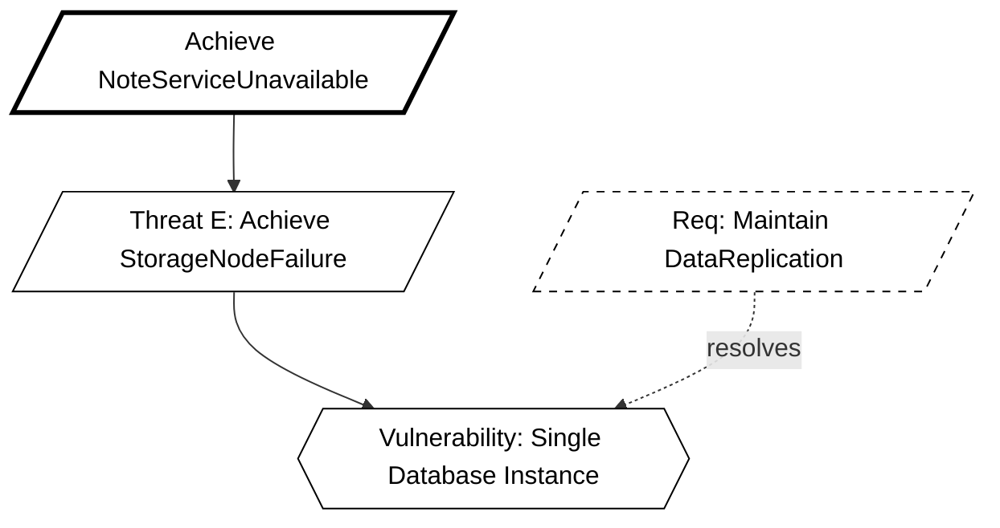

# KAOS Security Requirements Engineering Report
**Group:** 16<br>
**Methodology:** KAOS (Knowledge Acquisition in autOmated Specification)<br>
**Application:** Secure Notes App

## 1. Introduction
This document defines the security requirements for the Secure Notes Application using the Anti-Model construction method described by van Lamsweerde. We proceed by defining legitimate System Goals, deriving malicious Anti-Goals (Attacker Intents), refining these into Threat Trees, and finally selecting Countermeasures (Security Requirements).

## 1.1 Threat Agent Profiles (The "Who")
Based on the Anti-Model construction method we identify the following attacker classes:

1.  **The External Hacker:**
    * **Goal:** `Achieve [SensitiveDataStolen]` (Confidentiality breach).
    * **Capabilities:** Network sniffing, SQL injection tools (e.g., SQLMap), brute-force scripts.
    * **Motivation:** Financial gain or identity theft.

2.  **The Malicious Insider (The "Traitor"):**
    * **Goal:** `Achieve [WriteByReadOnlyUser]` (Integrity breach).
    * **Capabilities:** Authenticated access, knowledge of API endpoints, but limited permissions.
    * **Motivation:** Vandalism or privilege escalation.

---

## 2. Confidentiality Goals (User Isolation)

### 2.1 The System Goal
**Goal:** `Avoid [NoteContentKnownByUnauthorizedUser]`<br>
**Formal Pattern:** `Avoid [SensitiveInfoKnownByUnauthorizedAgent]`<br>
**Definition:** For any Note `n` and User `u`, if `u` is not the owner of `n` (and `n` is not shared with `u`), then `u` shall not know `n.content`.

### 2.2 The Anti-Model (Attacker Intent)
**Anti-Goal:** `Achieve [NoteContentKnownByUnauthorizedUser]`<br>
**Attacker:** Malicious User / External Hacker.

#### Threat Tree Refinement:
How can the attacker achieve this?
1.  **Threat A:** `Achieve [AccessNoteByGuessingID]`
    * **Vulnerability:** The system uses predictable, sequential IDs (e.g., `/notes/1`, `/notes/2`).
    * **Attacker Capability:** The attacker can iterate through integers to access resources they don't own.

2.  **Threat B:** `Achieve [AccessNoteBySQLInjection]`
    * **Vulnerability:** User input is concatenated directly into SQL queries.
    * **Attacker Capability:** Inject SQL fragments to bypass ownership checks (e.g., `' OR '1'='1`).

3.  **Threat C:** `Achieve [AccessNoteBySessionHijacking]`
    * **Vulnerability:** Session IDs are exposed or predictable.

4.  **Threat D (Infrastructure):** `Achieve [NoteContentSniffedOnNetwork]`
    * **Scenario:** An attacker on the same Wi-Fi network uses packet sniffing tools (e.g., Wireshark) to capture traffic between the user and the server.
    * **Vulnerability:** The application uses unencrypted HTTP channels for API communication.

5.  **Threat E (Client-Side):** `Achieve [NoteReadFromBrowserCache]`
    * **Scenario:** A user accesses the app from a shared computer (library/cafe). After they log out, an attacker hits the "Back" button to view cached pages.
    * **Vulnerability:** The server fails to send `Cache-Control: no-store` headers for sensitive JSON responses.

6.  **Threat F (Reconnaissance Milestone):** `Achieve [APIStructureKnown]`
    * **Scenario:** The attacker probes the API with malformed data to map out table names and column structures before launching an injection attack.
    * **Vulnerability:** The application returns verbose error messages (e.g., "Syntax error in table 'users'") or exposes public Swagger/OpenAPI documentation in production.

### 2.3 Derived Countermeasures
To resolve these threats, we introduce the following Security Requirements:

* **Countermeasure 1 (Protects against Threat A):** `Avoid [PredictableResourceIDs]`
    * **Implementation:** Use **UUIDs** (Universally Unique Identifiers) for all Note primary keys instead of auto-incrementing integers.
    * *Spring Boot:* Use `@GeneratedValue(strategy = GenerationType.UUID)` in the Note entity.

* **Countermeasure 2 (Protects against Threat B):** `Avoid [UnsanitizedDatabaseInput]`
    * **Implementation:** Use Parameterized Queries or an ORM that handles escaping.
    * *Spring Boot:* Use **Spring Data JPA** (Repository pattern) which automatically sanitizes inputs.

* **Countermeasure 3 (Protects against Threat C):** `Maintain [SecureSessionManagement]`
    * **Implementation:** Enforce strict session handling.
    * *Spring Boot:* Use **Spring Security** with HTTP-Only cookies and default session protection.

* **Countermeasure 4 (Protects against Threat D):** `Maintain [StrictTransportSecurity]`
    * **Implementation:** Enforce HTTPS for all traffic. Redirect HTTP to HTTPS.
    * *Spring Security:* Enable `requireChannel().anyRequest().requiresSecure()`.

* **Countermeasure 5 (Protects against Threat E):** `Avoid [SensitiveDataCaching]`
    * **Implementation:** Configure HTTP headers to prevent browser caching of API responses.
    * *Spring Security:* Add headers `Cache-Control: no-cache, no-store, max-age=0, must-revalidate`.

* **Countermeasure 6 (Protects against Threat F):** `Avoid [InformationLeakage]`
    * **Implementation:** Implement a global exception handler to return generic error messages (e.g., "An error occurred") instead of stack traces.

```mermaid
graph TD
    %% --- STYLING ---
    classDef root fill:#fff,stroke:#000,stroke-width:3px,color:#000;
    classDef goal fill:#fff,stroke:#000,stroke-width:1px,color:#000;
    classDef milestone fill:#fff,stroke:#000,stroke-width:2px,stroke-dasharray: 5 5,color:#000;
    classDef antiReq fill:#e0e0e0,stroke:#000,stroke-width:1px,color:#000;
    classDef vuln fill:#f9f9f9,stroke:#000,stroke-width:1px,stroke-dasharray: 5 5,color:#000;
    classDef cm fill:#fff,stroke:#000,stroke-width:1px,stroke-dasharray: 2 2,color:#000;

    %% ==========================================
    %% STRATEGIC ROOTS
    %% ==========================================
    AG_L1[/Achieve SensitiveDataStolen/]:::root
    AG_L2[/Achieve NoteContentKnownByUnauthorized/]:::goal
    AG_L1 --> AG_L2

    %% ==========================================
    %% THREAT F: RECONNAISSANCE (The Milestone)
    %% ==========================================
    AG_Milestone[/Milestone: Achieve APIStructureKnown/]:::milestone
    AG_L2 --> AG_Milestone

    Vuln_Verbose{{Vuln: VerboseErrorMessages}}:::vuln
    AG_Milestone --> Vuln_Verbose
    
    CM_Errors[Req: GenericErrorHandling]:::cm
    CM_Errors -.-> Vuln_Verbose

    %% ==========================================
    %% THREATS A & B: APPLICATION LOGIC ATTACKS
    %% ==========================================
    AG_AppLogic[/Achieve AccessViaAppLogic/]:::goal
    AG_Milestone --> AG_AppLogic

    %% --- THREAT A: ID GUESSING ---
    AG_L4_Direct[/Achieve AccessViaDirectReference/]:::goal
    AG_AppLogic --> AG_L4_Direct

    AG_L5_Probe[/Achieve ValidTargetIDIdentified/]:::goal
    AG_L4_Direct --> AG_L5_Probe

    AR_Iterate[Anti-Req: CheckIteratedIntegers]:::antiReq
    Vuln_SeqID{{Vuln: PredictableSequentialIDs}}:::vuln
    AG_L5_Probe --> AR_Iterate
    AG_L5_Probe --> Vuln_SeqID
    
    CM_UUID[Req: Avoid PredictableIDs]:::cm
    CM_UUID -.-> Vuln_SeqID

    %% --- THREAT B: SQL INJECTION ---
    AG_L4_Inject[/Achieve AccessViaQueryManipulation/]:::goal
    AG_AppLogic --> AG_L4_Inject

    AG_L5_Bypass[/Achieve AuthLogicBypassed/]:::goal
    AG_L4_Inject --> AG_L5_Bypass

    AR_SQL[Anti-Req: InjectSQLFragment]:::antiReq
    Vuln_Sanity{{Vuln: UnsanitizedInput}}:::vuln
    AG_L5_Bypass --> AR_SQL
    AG_L5_Bypass --> Vuln_Sanity

    CM_JPA[Req: Avoid UnsanitizedInput]:::cm
    CM_JPA -.-> Vuln_Sanity

    %% ==========================================
    %% THREAT C: SESSION HIJACKING
    %% ==========================================
    AG_Hijack[/Achieve AccessViaSessionTheft/]:::goal
    AG_L2 --> AG_Hijack

    AR_Steal[Anti-Req: StealSessionToken]:::antiReq
    Vuln_Sess{{Vuln: WeakSessionConfig}}:::vuln
    AG_Hijack --> AR_Steal
    AG_Hijack --> Vuln_Sess

    CM_SecureSess[Req: SecureSessionMgmt]:::cm
    CM_SecureSess -.-> Vuln_Sess

    %% ==========================================
    %% THREAT D: NETWORK SNIFFING (Infrastructure)
    %% ==========================================
    AG_Network[/Achieve NoteContentSniffedOnNetwork/]:::goal
    AG_L2 --> AG_Network

    AR_Sniff[Anti-Req: RunPacketSniffer]:::antiReq
    Vuln_HTTP{{Vuln: UnencryptedHTTP}}:::vuln
    AG_Network --> AR_Sniff
    AG_Network --> Vuln_HTTP

    %% This link was fixed below (Changed Vuln_HTTPS to Vuln_HTTP)
    CM_HTTPS[Req: EnforceHTTPS]:::cm
    CM_HTTPS -.-> Vuln_HTTP

    %% ==========================================
    %% THREAT E: CLIENT-SIDE CACHING
    %% ==========================================
    AG_Client[/Achieve NoteReadFromBrowserCache/]:::goal
    AG_L2 --> AG_Client

    AR_Back[Anti-Req: HitBackButton]:::antiReq
    Vuln_Cache{{Vuln: MissingCacheHeaders}}:::vuln
    AG_Client --> AR_Back
    AG_Client --> Vuln_Cache

    CM_NoCache[Req: DisableCaching]:::cm
    CM_NoCache -.-> Vuln_Cache  
```




## 3. Integrity Goals (Concurrency & Locking)

### 3.1 The System Goal

**Goal:** Maintain `[NoteContentChangeOnlyIfLockedAndAuthorized]`  
**Formal Pattern:** Maintain `[ObjectInfoChangeOnlyIfCorrectAndAuthorized]`

**Definition:**  
A Note `n` can only be updated by User `u` if:
- `u` has **WRITE permission** on `n`, and
- `n` is **currently locked by u** at the time of the update (the lock is valid and not expired), and
- the update is applied to the **current state of the note**.

This goal enforces data integrity, preventing accidental or malicious overwrites and unauthorized modifications.

---

### 3.2 The Anti-Model

**Anti-Goal:** Achieve `[NoteContentModifiedWithoutValidLockOrAuthorization]`  
**Attacker:** A second legitimate user, a read-only user abusing the API, or a race-condition exploit.

#### Threat Tree Refinement  
**How can the attacker achieve this?**

---

### Threat M: Achieve `[SimultaneousWriteConflict]`

**Scenario (general):**  
User A and User B open the same note.  
User A saves changes.  
User B saves changes shortly after, overwriting User A’s work.

#### Threat M – Sub-cases

**Threat M1: UpdateWithoutHoldingLock**  
- *Scenario:* User sends an update request without having previously acquired the lock.  
- *Vulnerability:* The server does not verify that the user currently holds the lock when processing an update.

**Threat M2: LockBypassViaDirectEndpoint**  
- *Scenario:* User directly calls `POST/PUT /api/notes/{id}` without going through “Edit Mode”.  
- *Vulnerability:* The update endpoint does not enforce prior lock acquisition or lock ownership validation.

**Threat M3: StaleLockNotReleased**  
- *Scenario:* User A acquires a lock and then closes the browser or loses network connection. The lock remains active indefinitely.  
- *Vulnerability:* No lock timeout (TTL) or automatic recovery mechanism exists.

**Threat M4: LostUpdateDueToMissingConcurrencyCheck**  
- *Scenario:* Two update requests based on different states of the same note are sent. The later request overwrites the earlier one without detection.  
- *Vulnerability:* The system does not verify that the update is based on the current state of the note.

**Threat M5: UnauthorizedUnlockOrLockStealing**  
- *Scenario:* User B attempts to unlock or re-lock a note currently locked by User A via a direct API call, then overwrites the content.  
- *Vulnerability:* The server does not enforce that only the lock owner (or an expired-lock policy) can unlock or change lock ownership.

---

### Threat N: Achieve `[WriteByReadOnlyUser]`

**Scenario (general):**  
User A shares a note with User B granting only **READ** permission.  
User B manually sends an HTTP request to modify the note.

#### Threat N – Sub-cases

**Threat N1: RawHTTPRequestByReadOnlyUser**  
- *Scenario:* User B crafts a `POST/PUT /api/notes/{id}` request manually.  
- *Vulnerability:* The backend verifies authentication but not **WRITE authorization**.

**Threat N2: UIOnlyAuthorization**  
- *Scenario:* The UI disables the edit button, but the server trusts the UI state.  
- *Vulnerability:* Authorization is enforced only at frontend level, not server-side.

**Threat N3: PermissionChangedButNotRechecked**  
- *Scenario:* User B previously had WRITE permission, later downgraded to READ. The update endpoint does not re-check permissions at write time.  
- *Vulnerability:* Authorization is not validated per request at the API/service layer.

**Attacker Capability:**  
The attacker can craft raw HTTP requests bypassing frontend restrictions.

---

### Threat P: Achieve `[WriteAfterLockExpiration]`

**Scenario (general):**  
User A acquires a lock on a note and enters edit mode.  
User becomes inactive for a long period.  
The lock expires, but User A sends an outdated update request.

#### Threat P – Sub-cases

**Threat P1: WriteWithExpiredLock**  
- *Scenario:* User sends an update after `lockedAt + TTL`.  
- *Vulnerability:* The server checks lock ownership but not lock validity.

**Threat P2: ReplayOfOldUpdateRequest**  
- *Scenario:* An old update request is resent after the lock has expired.  
- *Vulnerability:* No freshness or state validation is performed at write time.

---

### 3.3 Derived Countermeasures

#### Countermeasure 4 (Protects against Threat M and Threat P)

**Achieve `[ApplicationLevelLocking]`**

**Implementation:**  
Implement a strict **Locked Mode**, enforced server-side.

**Logic:**

- **Lock acquisition (Edit Mode):**
  - User requests “Edit Mode”.
  - Server checks `isLocked`:
    - if `false`:
      - set `isLocked = true`
      - set `lockedBy = User`
      - set `lockedAt = Now`
    - if `true` and `lockedBy != User`:
      - deny lock acquisition.

- **Update validation (`POST/PUT /api/notes/{id}`):**
  - verify `lockedBy == User`
  - verify `currentTime < lockedAt + TTL`
  - if lock expired → reject update and require re-lock.

- **Unlock:**
  - allow unlock only if:
    - `lockedBy == User`, or
    - lock is expired (automatic cleanup).

**Effect:**  
Prevents:
- simultaneous writes,
- updates without lock,
- updates using expired locks,
- unauthorized lock manipulation.

---

#### Countermeasure 5 (Protects against Threat N)

**Maintain `[GranularPermissionChecks]`**

**Implementation:**  
Enforce **Role-Based Access Control (RBAC)** at API/service level.

**Logic:**
- `POST/PUT /api/notes/{id}` received.
- Retrieve permission record for `(User, Note)`.
- If `permission != WRITE` → return `403 Forbidden`.

**Effect:**  
Ensures that read-only users cannot modify notes, regardless of UI behavior.

---

#### Countermeasure 6 (Protects against Threat M4)

**Maintain `[ConcurrencyTokenCheck]`**

**Implementation:**  
Associate each note with a **state identifier** (e.g., version number or ETag).

**Logic:**
- Client retrieves the note with its state identifier.
- Client sends the identifier with the update request.
- Server verifies that the identifier matches the current note state.
- If it does not match → reject the update (`409 Conflict`).

**Effect:**  
Prevents lost updates by ensuring that updates are applied only to the current state of a note.
```mermaid
graph TD
%% ================== STYLING ==================
classDef default fill:#ffffff,stroke:#000000,stroke-width:1px,color:#000000;
classDef bold fill:#ffffff,stroke:#000000,stroke-width:3px,color:#000000;
classDef dashed fill:#ffffff,stroke:#000000,stroke-width:1px,stroke-dasharray:5 5,color:#000000;

%% ================== ROOT ANTI-GOAL ==================
AG[/Achieve NoteContentModifiedWithoutValidLockOrAuthorization/]:::bold

%% ================== MAIN THREATS ==================
M[/Threat M: SimultaneousWriteConflict/]
N[/Threat N: WriteByReadOnlyUser/]
P[/Threat P: WriteAfterLockExpiration/]

AG --> M
AG --> N
AG --> P

%% ================== THREAT M SUB-CASES ==================
M1[/M1: UpdateWithoutHoldingLock/]
M2[/M2: LockBypassViaDirectEndpoint/]
M3[/M3: StaleLockNotReleased/]
M4[/M4: LostUpdateDueToMissingConcurrencyCheck/]
M5[/M5: UnauthorizedUnlockOrLockStealing/]

M --> M1
M --> M2
M --> M3
M --> M4
M --> M5

%% ================== THREAT M VULNERABILITIES ==================
VM1{{No lock ownership check on update}}
VM2{{Update endpoint does not enforce lock acquisition}}
VM3{{Missing lock TTL / recovery mechanism}}
VM4{{Missing state/version verification}}
VM5{{Unlock not restricted to lock owner}}

M1 --> VM1
M2 --> VM2
M3 --> VM3
M4 --> VM4
M5 --> VM5

%% ================== THREAT N SUB-CASES ==================
N1[/N1: RawHTTPRequestByReadOnlyUser/]
N2[/N2: UIOnlyAuthorization/]
N3[/N3: PermissionChangedButNotRechecked/]

N --> N1
N --> N2
N --> N3

%% ================== THREAT N VULNERABILITIES ==================
VN1{{Missing WRITE authorization at API}}
VN2{{Authorization enforced only in UI}}
VN3{{Permissions not rechecked per request}}

N1 --> VN1
N2 --> VN2
N3 --> VN3

%% ================== THREAT P SUB-CASES ==================
P1[/P1: WriteWithExpiredLock/]
P2[/P2: ReplayOfOldUpdateRequest/]

P --> P1
P --> P2

%% ================== THREAT P VULNERABILITIES ==================
VP1{{Lock validity (TTL) not checked}}
VP2{{No freshness/state validation}}

P1 --> VP1
P2 --> VP2

%% ================== COUNTERMEASURES ==================
CM4[/CM4: ApplicationLevelLocking/]:::dashed
CM5[/CM5: GranularPermissionChecks/]:::dashed
CM6[/CM6: ConcurrencyTokenCheck/]:::dashed

%% ================== RESOLUTION LINKS ==================
CM4 -. resolves .-> VM1
CM4 -. resolves .-> VM2
CM4 -. resolves .-> VM3
CM4 -. resolves .-> VM5
CM4 -. resolves .-> VP1
CM4 -. resolves .-> VP2

CM5 -. resolves .-> VN1
CM5 -. resolves .-> VN2
CM5 -. resolves .-> VN3

CM6 -. resolves .-> VM4

```

## 4. Availability Goals (Resilient Storage)

### 4.1 The System Goal
**Goal:** `Achieve [NoteAccessWhenNeeded]`<br>
**Formal Pattern:** `Achieve [ObjectInfoUsableWhenNeededAndAuthorized]`<br>
**Definition:** Authorized users must be able to retrieve their notes even if a primary storage node fails.

### 4.2 The Anti-Model
**Anti-Goal:** `Achieve [NoteServiceUnavailable]`<br>
**Attacker:** DoS Attacker or Physical Infrastructure Failure.

#### Threat Tree Refinement:
1.  **Threat F:** `Achieve [StorageNodeFailure]`
    * **Vulnerability:** The system relies on a single database instance (`db-master`). If this container stops, data is inaccessible.

### 4.3 Derived Countermeasures
* **Countermeasure 6 (Protects against Threat E):** `Maintain [DataReplication]`
    * **Implementation:** Deploy two distinct backend server instances connected to a replicated SQL database cluster.
    * *Architecture:*
        1.  **Primary Node (Server A):** Handles Writes and Reads.
        2.  **Replica Node (Server B):** Handles Reads (and failover Writes if promoted).
        3.  **Failover Logic:** The application configuration must allow switching the Data Source URL if the primary connection times out.



## 5. Summary of Security Requirements (To-Do List)

| ID | Requirement | KAOS Justification | Implementation Status |
|----|------------|--------------------|-----------------------|
| **SR-1** | Use UUIDs for Note IDs | Counteracts `AccessNoteByGuessingID` | Pending               |
| **SR-2** | Spring Data JPA | Counteracts `AccessNoteBySQLInjection` | Pending               |
| **SR-3** | Spring Security Config | Counteracts `NoteContentKnownByUnauthorizedUser` | Pending               |
| **SR-4** | Enforce HTTPS (TLS)             | Counteracts `NoteContentSniffedOnNetwork` | Pending |
| **SR-5** | Disable Browser Caching         | Counteracts `NoteReadFromBrowserCache`    | Pending |
| **SR-6** | Generic Error Handling          | Counteracts `APIStructureKnown`           | Pending |
| **SR-7** | Note Locking Mechanism | Counteracts `SimultaneousWriteConflict` | Pending               |
| **SR-8** | Granular Write Permission Check | Counteracts `WriteByReadOnlyUser` | Pending |
| **SR-9** | Database Replication | Counteracts `StorageNodeFailure` | Pending               |
